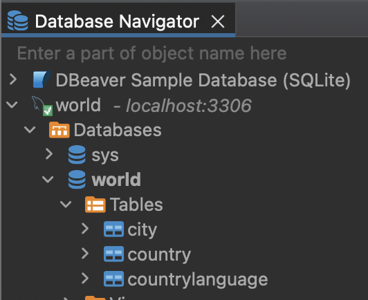

# Setup for Databases module

To follow this module you need to prepare 3 things:

- [Install MySQL](#installing-my-sql), the SQL database you will use
- [Install DBeaver](#installing-dbeaver), an application to ease interacting with the database
- [Setup the `world` database](#setting-up-the-world-database) in DBeaver

This guide provides step-by-step instructions on how to install these on different operating systems: macOS, Ubuntu, and Windows.

> [!WARNING]
> If you're using a different operating system, please find your way through other resources.

## Installing My SQL

### macOS

#### Using Homebrew

1. Open your Terminal.

2. Install Homebrew if you haven't already:

```shell
$ /bin/bash -c "$(curl -fsSL https://raw.githubusercontent.com/Homebrew/install/HEAD/install.sh)"
```

3. Install MySQL using Homebrew:

```shell
$ brew install mysql
```

4. Start MySQL service:

```shell
$ brew services start mysql
```

> [!TIP]
> If you install MySQL via Homebrew, the default username is `root`, and there is no password.

### Ubuntu

#### Using APT Package Manager

1. Open your Terminal.

2. Update the package list:

```shell
$ sudo apt update
```

3. Install MySQL Server:

```shell
sudo apt install mysql-server
```

4. During the installation, you'll be prompted to set a root password for MySQL.

5. Start the MySQL service:

```shell
sudo service mysql start
```

#### Using MySQL APT Repository

1. Visit the MySQL APT repository page: [MySQL APT Repository](https://dev.mysql.com/downloads/repo/apt/).

2. Download the repository package for Ubuntu and install it.

3. Update the package list:

```shell
$ sudo apt update
```

4. Install MySQL Server:

```shell
$ sudo apt install mysql-server
```

5. During the installation, you'll be prompted to set a root password for MySQL.

6. Start the MySQL service:

```shell
$ sudo service mysql start
```

### Windows

1. Download the MySQL Installer for Windows from the official website: [MySQL Downloads](https://dev.mysql.com/downloads/mysql/).

2. Run the installer executable and follow the installation wizard's instructions.

3. During installation, set up a root password for MySQL.

4. Choose the components you want to install. Select _at least_ MySQL Server.

5. Once the installation is complete, start the MySQL service using the MySQL Command Line Client or MySQL Workbench.

> [!IMPORTANT]
> Store the password you chose in a secure but handy place. You're going to need it throughout the module.

## Verification

To verify that MySQL is installed and running, open your Terminal or Command Prompt and run the following command:

```shell
$ mysql -u root -p
```

You will be prompted to enter the root password you set during installation. If MySQL is successfully running, you will be logged into the MySQL command-line interface.

## Installing DBeaver

You can interact with a MySQL database directly from your terminal using the `mysql` shell. However, it's more convenient to use a separate application - a SQL client.

DBeaver is a free, open source SQL client that works on macOS, Linux, and Windows that supports MySQL and many others SQL database engines. We recommend installing and using it during the module.

### macOS and Windows

1. Go to [DBeaver's Download page](https://dbeaver.io/download/)
1. Choose your OS and download the respective installer.
1. Open the installer and follow the instructions.

### Ubuntu

1. Add DBeaver to your list of repositories

```shell
$ sudo add-apt-repository ppa:serge-rider/dbeaver-ce
```

2. Update your package list

```shell
$ sudo apt-get update
```

3. Install DBeaver

```shell
$ sudo apt-get install dbeaver-ce
```

## Setting up the `world` database

For the exercises we'll be using an example database (`world`), so we must set it up.

To install the sample database, follow these steps:

1. If you haven't already, clone this repository and enter its directory:

```shell
$ git clone git@github.com:HackYourFutureBelgium/sql-database.git
$ cd sql-database
```

2. Import the `world` database:

```shell
$ mysql -u "root" -p < "week1/databases/world.sql" # enter your password when asked
```

This will connect to your MySQL server and execute the `world.sql` script.

3. Connect again to the MySQL server to confirm the `world` database is installed correctly.

```shell
$ mysql -u "root" -p # enter your password when asked

mysql> USE world;
mysql> SHOW TABLES;
```

You should see an output similar to the following:

```
+-----------------+
| Tables_in_world |
+-----------------+
| city            |
| country         |
| countrylanguage |
+-----------------+
3 rows in set (0.00 sec)
```

4. Instead of using your terminal, we recommend using DBeaver to interact with the database:

- Open DBeaver
- On the left sidebar ("Database Navigator"), click "New Database Connection"
- Choose `MySQL` as driver


- Enter the following information:
  - Server Host: `localhost`
  - Database: `world`
  - Username: `root`
  - Password: `<your-password>` (can be blank if you installed via Homebrew)

You should now see the `world` database and its tables on the Database Navigator:



- Open a SQL console by by right-clicking `world -> SQL Editor -> New SQL console`


- Then write a sample command:

```sql
SHOW TABLES;
```


If you see the sample above, everything is ok! You have successfully connected to the `world` database and can follow along to this week's [Readings](../week1/README.md) and [Exercises](../week1/EXERCISES.md)).
