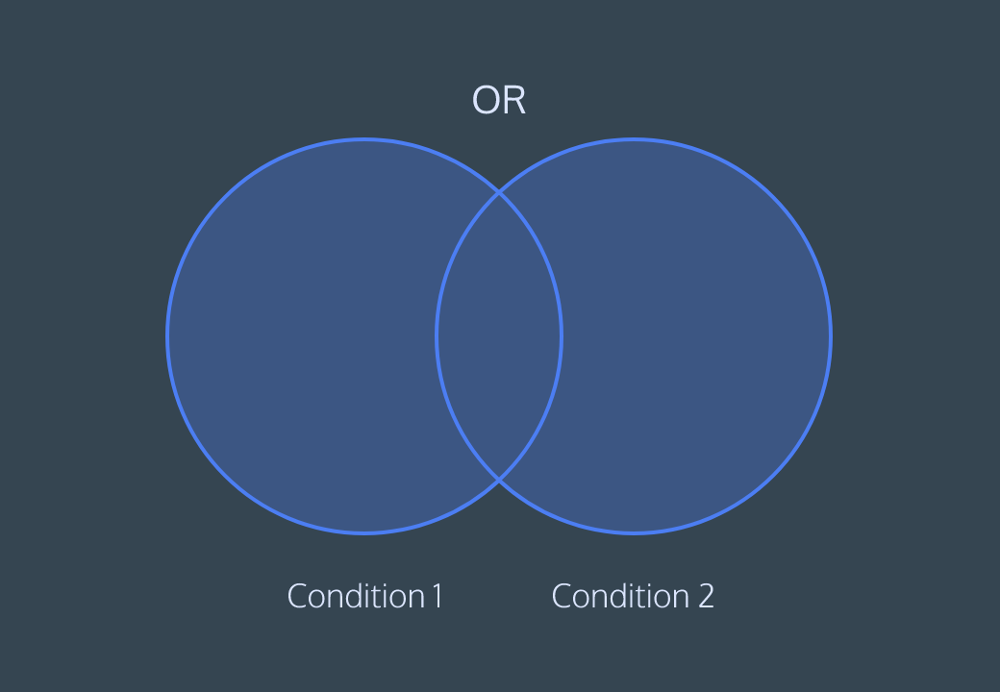

# Week 1

> "Every hour, every day, digital databases quietly store, cross-reference, and return information on every aspect of our lives."

https://www.computerhistory.org/revolution/memory-storage/8/265

## Topics

- [What is a database?](#what-is-a-database-1)
- [Querying data with SQL](#querying-data-with-sql2)
- [SQL Cheat Sheet?](#basic-sql-commands)
- TBD

## What is a database? <sup>[[1]](#references)</sup>

A database's primary purpose is to provide a mechanism for storing and retrieving information. There are many different types of databases but they all provides these two capabilities.

The easiest way to understand a database is as a collection of related files. Imagine a file (either paper or digital) of sales orders in a shop. Then there's another file of products, containing stock records. To fulfil an order, you'd need to look up the product in the order file and then look up and adjust the stock levels for that particular product in the product file. A database and the software that controls the database, called a database management system (DBMS), helps with this kind of task.

Most databases today are **relational databases**, named such because they deal with tables of data related by a common field. For example, [Table 1](#table-1---products) below shows the product table, and [Table 2](#table-2---orders) shows the orders table. As you can see, the relation between the two tables is based on the common field product_code. Any two tables can relate to each other simply by having a field in common.

#### Table 1 - Products
| `product_code` | `description`       | `price` |
|--------------|-------------------|-------|
| A416         | nails, box        | €0.14 |
| C923         | drawing pins, box | €0.08 |

#### Table 2 - Orders
| `order_code` | `order_item` | `product_code` | `quantity` |
|--------------|--------------|--------------|----------|
| 3804         | 1            | A416         | 10       |
| 3804         | 2            | C923         | 15       |

> [!IMPORTANT]
> Any two tables can relate to each other simply by creating a field they have in common. Table 1 and Table 2 share the `product_code` column.

Let's take a closer look at the previous two tables to see how they are organized:

- Each table consists of many **rows** and **columns**.
- Each new **row** contains data about one single entity (such as one product or one order line). This is also called a record. For example, the first row in Table 1 is a record; it describes the A416 product, which is a box of nails that costs fourteen cents. 
> [!NOTE] 
> The terms *row* and *record* are interchangeable.
- Each **column** (also called an attribute) contains one piece of data that relates to the record, called a tuple. Examples of attributes are the quantity of an item sold (`quantity`) or the price of a product (`price`). An attribute, when referring to a database table, is called a field. For example, the data in the `description` column in Table 1 are fields. 

> [!NOTE] 
> The terms *column*, *attribute* and *field* are interchangeable.

Given this kind of structure, the database gives you a way to manipulate this data: SQL. SQL (structured query language) is a powerful way to search for records or make changes. 

Relational databases go hand-in-hand with the development of SQL. The simplicity of SQL - where even a novice can learn to perform basic queries in a short period of time - is a large part of the reason for the popularity of the relational model.

Almost all DBMSs use SQL, although many have added their own enhancements to it. This means that when you learn using a specific DBMS like MySQL, almost all of it is not specific to MySQL and can be used with other relational databases as well, such as PostgreSQL, SQLite, MariaDB, and SQL Server. 

> [!TIP]
> SQL is pronounced "sequel"

There are many other types of databases besides relational databases, such as graph databases, non-relational databases (also called NoSQL databases), and key-value databases. In this module, we'll focus on relational databases (SQL), using MySQL for the exercises.

## SQL

SQL (Structured Query Language) is a standard programming language designed for managing and manipulating relational databases. It provides a powerful set of commands for querying, updating, and managing data stored in a relational database management system (RDBMS). This comprehensive guide aims to provide a detailed understanding of SQL, covering its syntax, data manipulation capabilities, data definition commands, advanced querying techniques, and more.

> [!IMPORTANT]
> Make sure you MySQL installed in your computer. If you haven't, follow the [MySQL installation guide](../setup/README.md) before continuing.

### Setup

In this lesson we'll be using an example `world` database.

To install the sample database, follow these steps:

1. Assuming you are in the repository's root directory, run the following in a terminal:

```shell
$ mysql -u "root" -p < "week1/databases/world.sql" # enter your password when asked
```

This will connect to your MySQL server and execute the `world.sql` script.

2. Connect again to the MySQL server to confirm the `world` database is installed correctly. 

```shell
$ mysql -u "root" -p # enter your password when asked

mysql> USE world;
mysql> SHOW TABLES;
```

You should see an output similar to the following:

```
+-----------------+
| Tables_in_world |
+-----------------+
| city            |
| country         |
| countrylanguage |
+-----------------+
3 rows in set (0.00 sec)
```

## Querying Data with SQL<sup>[[2]](#references)</sup>

In this lesson, we will be learning different SQL commands to query a table in a database.

One of the core purposes of the SQL language is to retrieve information stored in a database. This is commonly referred to as querying. Queries allow us to communicate with the database by asking questions and returning a result set with data relevant to the question.

We will be querying the `world` [<sup>[3]</sup>](#references) database.

Let’s get started! We should get acquainted with the `city` table.

If you haven't, [connect to your MySQL server](#setup), and then type the following:

```sql
mysql> SELECT * FROM city;
```

### SELECT

`SELECT` is used every time you want to query data from a database and `*` means all columns.

Suppose we are only interested in two of the columns. We can select individual columns by their names (separated by a comma):

```SQL
SELECT column1, column2 
FROM table_name;
```

To make it easier to read, we moved FROM to another line.

Line breaks don’t mean anything specific in SQL. We could write this entire query in one line, and it would run just fine.

Let’s only select the name and district columns of the table:

```sql
SELECT name, district FROM city;

-- +----------------+---------------+
-- | name           | district      |
-- +----------------+---------------+
-- | Kabul          | Kabol         |
-- | Qandahar       | Qandahar      |
-- | Herat          | Herat         |
-- (...)
-- 4079 rows in set
```

Now we want to include a third column.

Edit your query so that it returns the name, district, and population columns of the table.

```sql
-- Edit the query
SELECT ...
```

<details>
<summary>View solution</summary>

```sql
SELECT name, district, population FROM city;

-- +----------------+---------------+------------+
-- | name           | district      | population |
-- +----------------+---------------+------------+
-- | Kabul          | Kabol         |    1780000 |
-- | Qandahar       | Qandahar      |     237500 |
-- | Herat          | Herat         |     186800 |
-- (...)
-- 4079 rows in set
```
</details>

### AS

Knowing how `SELECT` works, suppose we have the code below:

```sql
SELECT name AS 'City Name' FROM city;
```

Can you guess what `AS` does?

`AS` is a keyword in SQL that allows you to rename a column or table using an alias. The new name can be anything you want. Here we renamed the name column as `City Name`.


> [!IMPORTANT]
> When using `AS`, the columns are not being renamed in the table. The aliases only appear in the result.

To experiment with what the `AS` keyword does, select the population column and rename it with an alias of your choosing:

```sql
-- Return population column with an alias
SELECT ___ AS '______' FROM city;
```

<details>
<summary>View solution</summary>

```sql
--- Example
SELECT population as 'Number of Habitants' FROM city;
```
</details>

<br>

Now, edit the query so that instead of selecting and renaming `population`, select the `countrycode` column and rename it to `ISO Country Code`

```sql
-- Return countrycode column with an alias
SELECT ___ AS '______' FROM city;
```

<details>
<summary>View solution</summary>

```sql
SELECT countrycode as 'ISO Country Code' FROM city;

-- +------------------+
-- | ISO Country Code |
-- +------------------+
-- | ABW              |
-- | AFG              |
-- (...)
-- 4079 rows in set

```
</details><br>

> [!TIP]
> You can alias multiple columns in a single query:
> ```sql 
> SELECT name AS n, countrycode AS c FROM city;
> ```

### Distinct

When we are examining data in a table, it can be helpful to know what distinct values exist in a particular column.

`DISTINCT` is used to return unique values in the output. It filters out all duplicate values in the specified column(s).

For instance,

```sql
SELECT tools FROM inventory;
```

might produce:

| tools  |
|--------|
| Hammer |
| Nails  |
| Nails  |
| Nails  |

By adding `DISTINCT` before the column name,

```sql
SELECT DISTINCT tools FROM inventory;
```

the result would now be:

| tools  |
|--------|
| Hammer |
| Nails  |

Filtering the results of a query is an important skill in SQL. It is easier to see the different countries in the `city` table after the data has been filtered than to scan every row in the table.

Let's try it out:

```sql
SELECT DISTINCT countrycode from city;
```

Now, change the code so we return the unique values of the `district` column instead.

```sql
-- Return the unique values of the `district` column
SELECT ...
```

<details>

<summary>View solution</summary>

```sql
SELECT DISTINCT district from city;

-- +---------------+
-- | district      |
-- +---------------+
-- | Kabol         |
-- | Qandahar      |
-- | Herat         |
-- (...)
-- 4079 rows in set
```
</details>
 
### `WHERE`

We can restrict our query results using the `WHERE` clause in order to obtain only the information we want.

Following this format, the statement below filters the result set to only include the most populated cities (over 5 million habitants):

```sql
SELECT * FROM city WHERE population > 5000000;

-- +------+----------------+-------------+----------------+------------+
-- | ID   | Name           | CountryCode | District       | Population |
-- +------+----------------+-------------+----------------+------------+
-- |  206 | São Paulo      | BRA         | São Paulo      |    9968485 |
-- |  207 | Rio de Janeiro | BRA         | Rio de Janeiro |    5598953 |
-- (...)
-- 24 rows in set
```

How does it work?

1. The `WHERE` clause filters the result set to only include rows where the following condition is true.

1. `population > 5000000` is the condition. Here, only rows with a value greater than 5000000 in the `population` column will be returned.

The `>` is an operator. Operators create a condition that can be evaluated as either *true* or *false*.

Comparison operators used with the `WHERE` clause are:

- `=` equal to
- `!=` not equal to
- `>` greater than
- `<` less than
- `>=` greater than or equal to
- `<=` less than or equal to

There are also some special operators that we will learn more about in the upcoming exercises.

Now, suppose we want to known which are the *least* populated cities (population under 1000):

```sql
-- Retrieve the cities with less than 1000 people. Select all columns
SELECT ...
```

<details>

<summary>View solution</summary>

```sql
SELECT * FROM city WHERE population < 1000;

-- +------+---------------------+-------------+-------------+------------+
-- | ID   | Name                | CountryCode | District    | Population |
-- +------+---------------------+-------------+-------------+------------+
-- |   61 | South Hill          | AIA         | –           |        961 |
-- |   62 | The Valley          | AIA         | –           |        595 |
-- | 1791 | Flying Fish Cove    | CXR         | –           |        700 |
-- (...)
-- 11 rows in set
```
</details><br>

> [!TIP] You can compare the values of two columns in a `WHERE` clause:
> ```sql
> SELECT x, y FROM coordinates WHERE x > y;
> ```

### Like

`LIKE` can be a useful operator when you want to compare similar values.

There are 2 cities in China with similar names: `Anshun` and `Anshan`.

How could we select all cities that start with ‘Ansh’ and end with ‘n’ and have exactly one character in between?

```sql
SELECT * FROM city WHERE name LIKE 'Ansh_n';

-- +------+--------+-------------+----------+------------+
-- | ID   | Name   | CountryCode | District | Population |
-- +------+--------+-------------+----------+------------+
-- | 1918 | Anshan | CHN         | Liaoning |    1200000 |
-- | 2106 | Anshun | CHN         | Guizhou  |     174142 |
-- +------+--------+-------------+----------+------------+
```

- `LIKE` is a special operator used with the `WHERE` clause to search for a specific pattern in a column.

- `name LIKE 'Se_en'` is a condition evaluating the name column for a specific pattern.

- `Ansh_n` represents a pattern with a wildcard character.

The `_` means you can substitute any individual character here without breaking the pattern. The names `Anshan` and `Anshun` both match this pattern.

#### Percentage wildcard - `%`

The percentage sign `%` is another wildcard character that can be used with `LIKE`.

This statement below filters the result set to only include cities with names that begin with the word ‘San’:

```sql
SELECT * 
FROM city
WHERE name LIKE 'San%';
```

`%` is a wildcard character that matches zero or more missing characters in the pattern. For example:

- `A%` matches all cities with names that begin with letter ‘A’
- `%a` matches all cities that end with ‘a’
- `San %` matches all cities with names that begin with the word `San` (mind the whitespace!)
    - ✅ `San Felipe`, `San Francisco`, `San Marino`...
    - ❌ `Santa Monica`
- `%land` matches all cities with names that end with `land`
    - `Sunderland`, `Auckland`, `Portland`...


We can also use `%` both before and after a pattern:

```sql
SELECT * FROM city WHERE name LIKE '%los%';

-- +------+----------------------------+-------------+--------------+------------+
-- | ID   | Name                       | CountryCode | District     | Population |
-- +------+----------------------------+-------------+--------------+------------+
-- |  117 | San Nicolás de los Arroyos | ARG         | Buenos Aires |     119302 |
-- |  316 | São Carlos                 | BRA         | São Paulo    |     187122 |
-- |  357 | Ferraz de Vasconcelos      | BRA         | São Paulo    |     139283 |
-- |  568 | Los Angeles                | CHL         | Bíobío       |     158215 |
-- (...)
```

Here, any city that contains the word ‘los’ in its name will be returned in the result.

`LIKE` is not case sensitive. ‘Los Angelos’ and ‘São Carlos’ both appear in the result of the query above.

How many cities contain the word `saint`?

```sql
-- Return the cities with names that contain the word 'saint'
SELECT ...
```

<details>

<summary>View solution</summary>

```sql
SELECT * FROM city WHERE name LIKE '%saint%';
-- Answer: 13 cities
```
</details><br>

One more: how many cities *begin* with the word `New`? Tip: you may need a space in there.

```sql
-- Return the cities with names that start with the word 'New'
SELECT ...
```

<details>

<summary>View solution</summary>

```sql
SELECT * FROM city WHERE name LIKE '%New ';
-- Answer: 6 cities
```
</details><br>

## Null

Let's go over to the `country` table for a while.

This table has more columns, and some records contain a few missing values. More often than not, the data you encounter will have missing values.

- Unknown values are indicated by `NULL`.
- It is not possible to test for `NULL` values with comparison operators, such as `=` and `!=`.
- Instead, we will have to use these operators:
    - `IS NULL`
    - `IS NOT NULL`

For example, we can use `IS NOT NULL` to retrieve countries for which an independence year is registered (`indepyear` column):

```sql
SELECT name, indepyear FROM country WHERE indepyear IS NOT NULL

-- +----------------------+-----------+
-- | name                 | indepyear |
-- +----------------------+-----------+
-- | Afghanistan          |      1919 |
-- | Angola               |      1975 |
-- | Albania              |      1912 |
-- (...)
```

Now let’s do the opposite. Write a query to find all countries for which there is no independence day registered:

```sql
-- Retrive countries without an independence. Select only the 'name' column
SELECT ...
```

<details>

<summary>View solution</summary>

```sql
SELECT name FROM country WHERE indepyear IS NULL;

-- +----------+
-- | name     |
-- +----------+
-- | Aruba    |
-- | Anguilla |
-- (...)
```
</details>

### `AND`

Sometimes we want to combine multiple conditions in a `WHERE` clause to make the result set more specific and useful.

One way of doing this is to use the `AND` operator. Here, we use the `AND` operator to only return European countries with over 1 million of population:

```sql
SELECT * 
FROM country
WHERE continent = 'Europe'
AND population > 1000000;

-- other columns ommited
-- +---------+------------+
-- | name    | population |
-- +---------+------------+
-- | Albania |    3401200 |
-- | Austria |    8091800 |
-- | Belgium |   10239000 |
-- (...)
-- 35 rows in set
```

- `continent = 'Europe'` is the 1st condition
- `population > 1000000` is the 2nd condition
- `AND` combines the 2 conditions


With `AND`, both conditions must be true for the row to be included in the result.

Now, let's go back to the `city` table and practice! Retrieve every city from the United States (hint: also known as `USA`), that have few inhabitants (less than 90 thousand):

```sql
-- Retrieve cities in the USA with less than 90 thousand of population
SELECT ...
```

<details>

<summary>View solution</summary>

```sql
SELECT * FROM city WHERE countrycode = 'USA' AND population < 90000;

-- +------+------------+-------------+----------------+------------+
-- | ID   | Name       | CountryCode | District       | Population |
-- +------+------------+-------------+----------------+------------+
-- | 4062 | Kenosha    | USA         | Wisconsin      |      89447 |
-- | 4063 | Elgin      | USA         | Illinois       |      89408 |
-- (...)
-- 5 rows in set
```
</details><br>

Finally, how many German cities in district of 'Nordrhein-Westfalen' have over 250 thounsad inhabitants?

```sql
-- Retrieve cities in the district of Nordrhein-Westfalen with more than 250000 of population
SELECT ...
```

<details>

<summary>View solution</summary>

```sql
SELECT * from city where district  = 'Nordrhein-Westfalen' and population > 250000;

-- +------+-------------+-------------+---------------------+------------+
-- | ID   | Name        | CountryCode | District            | Population |
-- +------+-------------+-------------+---------------------+------------+
-- | 3071 | Köln        | DEU         | Nordrhein-Westfalen |     962507 |
-- | 3073 | Essen       | DEU         | Nordrhein-Westfalen |     599515 |
-- (...)
-- 12 rows in set
```
</details><br>

### `OR`

Similar to `AND`, the `OR` operator can also be used to combine multiple conditions in `WHERE`, but there is a fundamental difference:

- `AND` operator displays a row if *all* the conditions are true.
- `OR` operator displays a row if *any* condition is true.

Suppose you're considering a vacation either in Portugal or Spain:

```sql
SELECT * 
FROM city
WHERE countrycode = 'PRT' OR countrycode = 'ESP';

-- +-----+---------+-------------+----------+------------+
-- | ID  | Name    | CountryCode | District | Population |
-- +-----+---------+-------------+----------+------------+
-- | 653 | Madrid  | ESP         | Madrid   |    2879052 |
-- (...)
-- | 2914 | Lisboa | PRT         | Lisboa   |     563210 |
-- (...)
-- 64 rows in set
```

- `contrycode = 'PRT'` is the 1st condition
- `contrycode = 'ESP'` is the 2nd condition
- `OR` combines the two conditions



With `OR`, if any of the conditions are true, then the row is added to the result.

It's your turn! Write a query that returns all cities in either Finland (`FIN`) or Norway (`NOR`)

```sql
-- Retrive cities in either Finland or Norway
SELECT ...
```

<summary>View solution</summary>

```sql
SELECT * FROM city WHERE countrycode  = 'FIN' OR countrycode = 'NOR';

-- +------+------------------------+-------------+----------+------------+
-- | ID   | Name                   | CountryCode | District | Population |
-- +------+------------------------+-------------+----------+------------+
-- | 3236 | Helsinki [Helsingfors] | FIN         | Newmaa   |     555474 |
-- (...)
-- | 2807 | Oslo                   | NOR         | Oslo     |     508726 |
-- (...)
-- 12 rows in set
```
</details><br>

### `ORDER BY`

It is often useful to list the data in our result set in a particular order.

We can sort the results using `ORDER BY`, either alphabetically or numerically. Sorting the results often makes the data more useful and easier to analyze.

For example, if we want to sort everything by the cities' name from A through Z:

```sql
SELECT * FROM city ORDER BY name;
```

- `ORDER BY` is a clause that indicates you want to sort the result set by a particular column.
- `name` is the specified column.

Sometimes we want to sort things in a decreasing order. For example, if we want to select cities with a large population, sorted from highest to lowest:

```sql
SELECT * 
FROM city 
WHERE population > 9000000 
ORDER BY population DESC;

-- +------+-----------------+-------------+--------------+------------+
-- | ID   | Name            | CountryCode | District     | Population |
-- +------+-----------------+-------------+--------------+------------+
-- | 1024 | Mumbai (Bombay) | IND         | Maharashtra  |   10500000 |
-- | 2331 | Seoul           | KOR         | Seoul        |    9981619 |
-- (...)
-- 6 rows in set
```

- `DESC` is a keyword used in `ORDER BY` to sort the results in `descending` order (high to low or Z-A).

- `ASC` is a keyword used in `ORDER BY` to sort the results in ascending order (low to high or A-Z).

The column that we `ORDER BY` doesn’t even have to be one of the columns that we’re displaying.

Note: `ORDER BY` always goes after `WHERE` (if `WHERE` is present).

Your turn! Write a query that retrieves the `name` and `population` columns of all cities, ordered by their name in *descending* alphabetical order.

```sql
-- Retrieve cities in descending alphabetical order by name. Retrieve `name` and `population`
SELECT ...
```

<summary>View solution</summary>

```sql
SELECT name, population FROM city ORDER BY name DESC;

-- +---------+------------+
-- | name    | population |
-- +---------+------------+
-- | Zytomyr |     297000 |
-- | Zwolle  |     105819 |
-- | Zwickau |     104146 |
-- (...)
-- 4079 rows in set
```
</details>

### `LIMIT`

You may have noticed that the `city` table contains thousands of records. Sometimes, it's useful to cap the numbers of rows in query results, to reduce noise.

For example, imagine that we just want to see a few examples of records:

```sql
SELECT *
FROM city
LIMIT 10;
```

- `LIMIT` is a clause that lets you specify the maximum number of rows the result set will have. This saves space on our screen and makes our queries run faster.

- Here, we specify that the result set can’t have more than 10 rows.

- `LIMIT` always goes at the very end of the query. Also, it is not supported in all SQL databases.

Your turn! Combining your knowledge of `LIMIT` and `ORDER BY`, write a query that returns the top 3 highest populated cities.

```sql
-- Retrive the 3 most populated cities. Select all columns
SELECT ...
```

<summary>View solution</summary>

```sql
SELECT * FROM city ORDER by population DESC LIMIT 3;

-- +------+-----------------+-------------+-------------+------------+
-- | ID   | Name            | CountryCode | District    | Population |
-- +------+-----------------+-------------+-------------+------------+
-- | 1024 | Mumbai (Bombay) | IND         | Maharashtra |   10500000 |
-- | 2331 | Seoul           | KOR         | Seoul       |    9981619 |
-- |  206 | São Paulo       | BRA         | São Paulo   |    9968485 |
-- +------+-----------------+-------------+-------------+------------+
-- 3 rows in set
```
</details>

> [!TIP] If the number set in the `LIMIT` clause surpasses the number of rows available to select, then it will just return the rows that are present.

### Summary

We just learned how to query data from a database using SQL using real life `world` data. We also learned how to filter queries to make the information more specific and useful.

In summary:

- `SELECT` is the clause we use every time we want to query information from a database.
- `AS` renames a column or table.
- `DISTINCT` return unique values.
- `WHERE` is a popular command that lets you filter the results of the query based on conditions that you specify.
- `LIKE` is a special operator that accepts wildcards ( for example `%s`, and `_`).
- `AND` and `OR` combines multiple conditions.
- `ORDER BY` sorts the result.
- `LIMIT` specifies the maximum number of rows that the query will return.

Feel free to experiment a bit more with the `world` database before moving on!


> [!WARNING]
> Section below to review
## Basic SQL Commands

### SELECT Statement

The SELECT statement is used to retrieve data from one or more tables in a database. It allows you to specify the columns you want to retrieve and filter the rows based on certain criteria.

Example:

```sql
SELECT column1, column2
FROM table_name
WHERE condition;
```

### INSERT Statement

The INSERT statement is used to add new rows of data into a table. It specifies the values to be inserted into each column.

Example:

```sql
INSERT INTO table_name (column1, column2)
VALUES (value1, value2);
```

### UPDATE Statement

The UPDATE statement is used to modify existing data in a table. It allows you to change the values of one or more columns in one or more rows.

Example:

```sql
UPDATE table_name
SET column1 = value1, column2 = value2
WHERE condition;
```

### DELETE Statement

The DELETE statement is used to remove one or more rows from a table based on a specified condition.

Example:

```sql
DELETE FROM table_name
WHERE condition;
```

## Data Definition Language (DDL)

### CREATE TABLE

The CREATE TABLE statement is used to create a new table in the database. It specifies the table name and the columns it will contain, along with their data types and any constraints.

Example:

```sql
CREATE TABLE table_name (
    column1 datatype1,
    column2 datatype2,
    ...
);
```

### ALTER TABLE

The ALTER TABLE statement is used to modify an existing table structure. It allows you to add, modify, or drop columns, as well as add or remove constraints.

Example:

```sql
ALTER TABLE table_name
ADD column_name datatype;
```

### DROP TABLE

The DROP TABLE statement is used to delete an existing table from the database. It permanently removes all data and structure associated with the table.

Example:

```sql
DROP TABLE table_name;
```

## Data Manipulation Language (DML)

### INSERT INTO

The INSERT INTO statement is used to add new rows of data into a table. It specifies the values to be inserted into each column.

Example:

```sql
INSERT INTO table_name (column1, column2)
VALUES (value1, value2);
```

### UPDATE

The UPDATE statement is used to modify existing data in a table. It allows you to change the values of one or more columns in one or more rows.

Example:

```sql
UPDATE table_name
SET column1 = value1, column2 = value2
WHERE condition;
```

### DELETE FROM

The DELETE FROM statement is used to remove one or more rows from a table based on a specified condition.

Example:

```sql
DELETE FROM table_name
WHERE condition;
```

## Advanced SQL Queries

### Joins

Joins are used to combine rows from two or more tables based on a related column between them. Common types of joins include INNER JOIN, LEFT JOIN, RIGHT JOIN, and FULL JOIN.

Example:

```sql
SELECT *
FROM table1
INNER JOIN table2 ON table1.column_name = table2.column_name;
```

### Subqueries

Subqueries are nested SELECT statements that can be used within another SQL statement. They can be used to filter, aggregate, or perform calculations on data.

Example:

```sql
SELECT *
FROM table_name
WHERE column_name IN (SELECT column_name FROM another_table WHERE condition);
```

### Aggregation Functions

Aggregation functions are used to perform calculations on sets of data. Common aggregation functions include SUM, AVG, COUNT, MIN, and MAX.

Example:

```sql
SELECT AVG(column_name)
FROM table_name;
```

## Data Control Language (DCL)

### GRANT

The GRANT statement is used to give specific privileges to users or roles in a database. Privileges include SELECT, INSERT, UPDATE, DELETE, and more.

Example:

```sql
GRANT SELECT, INSERT ON table_name TO user_name;
```

### REVOKE

The REVOKE statement is used to revoke previously granted privileges from users or roles in a database.

Example:

```sql
REVOKE INSERT ON table_name FROM user_name;
```

## Data Querying Techniques

### Filtering Data

Filtering data involves selecting only the rows that meet specific criteria using the WHERE clause in a SELECT statement.

Example:
```sql
SELECT * FROM table_name WHERE column_name = value;
```

### Sorting Data

Sorting data involves arranging the rows of a result set in a specified order using the ORDER BY clause in a SELECT statement.

Example:

```sql
SELECT * FROM table_name ORDER BY column_name ASC;
```

### Grouping Data

Grouping data involves aggregating rows of a result set based on one or more columns using the GROUP BY clause in a SELECT statement.

Example:

```sql
SELECT column_name, COUNT(*)
FROM table_name
GROUP BY column_name;
```

### Transactions

### ACID Properties

Transactions in SQL adhere to the ACID properties: Atomicity, Consistency, Isolation, and Durability. Atomicity ensures that a transaction is treated as a single unit, Consistency ensures that the database remains in a consistent state before and after the transaction, Isolation ensures that multiple transactions can occur concurrently without interfering with each other, and Durability ensures that the changes made by a committed transaction are permanent and survive system failures.

### Transaction Control Commands

SQL provides commands for controlling transactions:

- **BEGIN TRANSACTION**: Starts a new transaction.
- **COMMIT**: Saves the changes made by a transaction to the database.
- **ROLLBACK**: Undoes the changes made by a transaction and restores the database to its previous state.
- **SAVEPOINT**: Sets a named point in a transaction to which you can later roll back.

Example:

```sql
BEGIN TRANSACTION;

-- SQL statements

COMMIT;
```

## SQL Best Practices

### Use of Indexes

Indexes are used to improve the performance of queries by allowing the database to quickly locate rows based on the indexed columns. It's important to create indexes on columns frequently used in WHERE clauses or JOIN conditions, but over-indexing should be avoided as it can degrade performance during data modifications.

Example:

```sql
CREATE INDEX index_name ON table_name (column_name);
```

### Normalization

Normalization is the process of organizing data in a database to reduce redundancy and improve data integrity. It involves breaking down large tables into smaller, related tables and establishing relationships between them using foreign keys. This helps to minimize data duplication and ensures consistency throughout the database.

### Avoiding SQL Injection

SQL injection is a common security vulnerability that occurs when an attacker is able to manipulate SQL queries through user input. To prevent SQL injection, it's important to use parameterized queries or prepared statements, which separate SQL code from user input and sanitize input data before executing it.

Example (using parameterized query):

```sql
SELECT * FROM users WHERE username = ? AND password = ?;
```


## References

[1] Adapted from MariaDB's ["Introduction to Relational Databases"](https://mariadb.com/kb/en/introduction-to-relational-databases/)

[2] Adapted from Codecademy's ["Learn SQL"](https://www.codecademy.com/enrolled/courses/learn-sql) course

[3] Sample `world` database from [MySQL / Oracle](https://dev.mysql.com/doc/world-setup/en/)