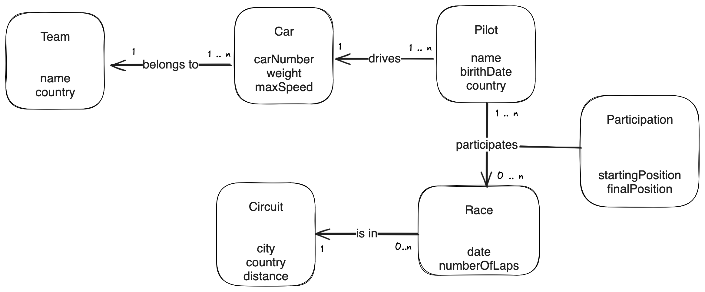

> [!WARNING]
> This section is under development

# Exercises Week 2

## Exercise 1: Company[[1](#references)]

You are tasked with designing the conceptual model of a database to map a company's structure. 

Here is what you know:
- A company has several departments.
- Each department has a name, a number and a manager.
- A department controls a number of projects. Each project has a name and a number.
- Each employee has a name, a number, an address and a salary.
- An employee belongs to a department but can work in many projects (some of them from different departments).
- Each employee can have a supervisor assigned to him.

**Exercise: design an [ER diagram](./README.md#entity-relationships-diagrams) to represent the company's structure.**

Some tips:
- You can use the format used in this week's [Readings](./README.md#entity-relationships-diagrams), but the main goal is to get the relationships and attributes right. The diagram doesn't have to look amazing
- You can use a tool like [Excalidram](https://excalidraw.com/) or [Draw.io](https://app.diagrams.net/), or just pen an paper
- Remember that managers and supervisors are also employees
- Follow this high level approach:
    1. Identify the entities
    1. Identify the relationships between the entities
    1. Identify the cardinality of the relationships (one-to-one, one-to-many, many-to-many)
    1. Optional: add the attributes to store (name, etc)

## Exercise 2: Gardener

You are now tasked with designing a database to help out a local gardener.

John is a gardener who's in charge of the maintenance his clients' gardens. Thus, he
wants to know about each client: their name, tax number, address and location. 

For each garden it is necessary to know: the name, address, location, area (in
hectares), the customer responsible for this garden and whether they own the
garden or are just exploring it. A customer can have multiple gardens.

Still for each garden is necessary to know the types of plants that are found there, the area occupied by each of these plant types, and number of plants of each type. About the types of plant, it's important to know its common name (for example: orange blossom) and its scientific name (e.g., *citrus sinensis*).

For each type of plant it still matters to know the pests that affect it (for example, the orange trees can have cochineal). For each pest, it's important to know whether or not a treatment exists.

**Exercise: design an [ER diagram](./README.md#entity-relationships-diagrams) to represent needs of John.** Remember the tips from [Exercise 1](#exercise-1-company).

## Exercise 3: Formula 1

You are now tasked with creating a database for a simplified version of a Formula 1 season.

This time, the conceptual model is already complete.

**Exercise:** create a database for Formula 1 by following the diagram and writing a set of `CREATE TABLE` statements in a `s1.sql` file. 

## Exercise 4: LinkedIn[[2](#references)]

Now, you'll create a database from scratch.

Create a database representing LinkedIn from scratch, as by writing a set of `CREATE TABLE ` statements in a `linkedin.sql` file. The implementation details are up to you, though you should minimally ensure that your database meets the platform’s specification and that it can represent the given sample data.

#### Users

The heart of LinkedIn’s platform is its people. Your database should be able to represent the following information about LinkedIn’s users:

- Their first and last name
- Their username
- Their password. No need to worry about hashing passwords.

#### Schools and Universities

LinkedIn also allows for official school or university accounts, such as that for [HackYourFuture Belgium](https://www.linkedin.com/school/hackyourfuture-belgium/), so alumni (i.e., those who’ve attended) can identify their affiliation. Ensure that LinkedIn’s database can store the following information about each school:

- The name of the school
- The type of school (e.g., “Elementary School”, “Middle School”, “High School”, “Lower School”, “Upper School”, “College”, “University”, etc.)
- The school’s location
- The year in which the school was founded

#### Companies

LinkedIn allows companies to create their own pages, like the one for [HackYourFuture Belgium](), so employees can identify their past or current employment with the company. Ensure that LinkedIn’s database can store the following information for each company:

- The name of the company
- The company’s industry (e.g., “Education”, “Technology, “Finance”, etc.)
- The company’s location

#### Connections

And finally, the essence of LinkedIn is its ability to facilitate connections between people. Ensure LinkedIn’s database can support each of the following connections.

**Connections with People**: 
- LinkedIn’s database should be able to represent mutual (reciprocal, two-way) connections between users. No need to worry about one-way connections, such as user A “following” user B without user B “following” user A.
Connections with Schools
- A user should be able to create an affiliation with a given school. And similarly, that school should be able to find its alumni. Additionally, allow a user to define:
    - The start date of their affiliation (i.e., when they started to attend the school)
    - The end date of their affiliation (i.e., when they graduated), if applicable
    - The type of degree earned/pursued (e.g., “BA”, “MA”, “PhD”, etc.)

**Connections with Companies:**
- A user should be able to create an affiliation with a given company. A company should be able to find its current and past employees. 
- Additionally, allow a user to define:
    - The start date of their affiliation (i.e., the date they began work with the company)
    - The end date of their affiliation (i.e., when left the company), if applicable
    - The title they held while affiliated with the company

Your database should be able to represent…

- A user, Alan Garber, whose username is “alan” and password is “password”.
- A user, Reid Hoffman whose username is “reid” and password is “password”.
- A school, Harvard University, which is a university located in Cambridge, Massachusetts, founded in 1636.
- A company, LinkedIn, which is a technology company headquartered in Sunnyvale, California.
- Alan Garber’s undergraduate education at Harvard, pursuing a BA from September 1st, 1973 to June 1st, 1976.
- Reid Hoffman’s employment with LinkedIn as its CEO and Chairman, from January 1st, 2003 to February 1st, 2007.

## Submitting your work

Once you've completed the exercises, please share them with your Coach:
- [Class 22](https://github.com/HackYourFutureBelgium/sql-database/issues/27)
- [Class 23](https://github.com/HackYourFutureBelgium/sql-database/issues/28)

## References

- [1] Adapted from André Restivo's ["Relational Model"](https://web.fe.up.pt/~arestivo/slides/?s=entityrelationship#30) slides 
- [2] Adapted from [CS50’s Introduction to Databases with SQL](https://cs50.harvard.edu/sql/2024/psets/2/connect)