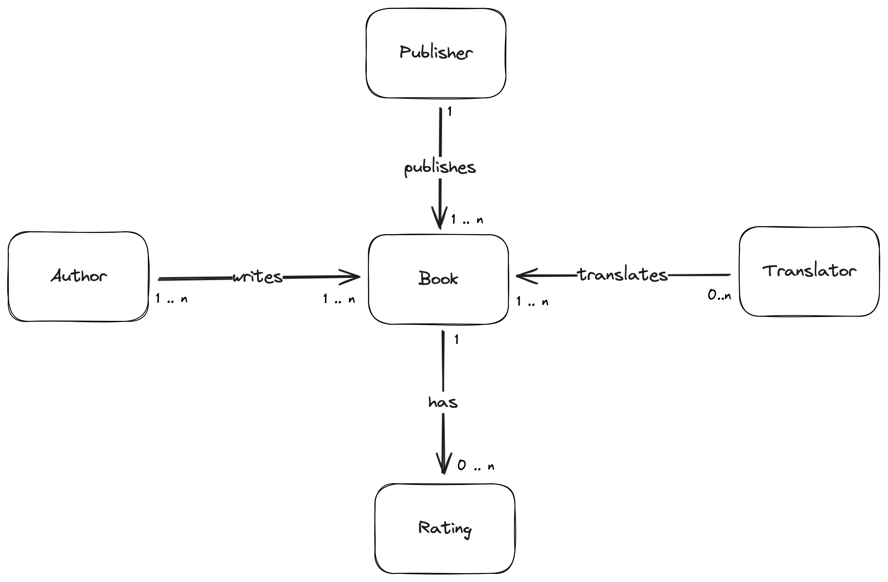
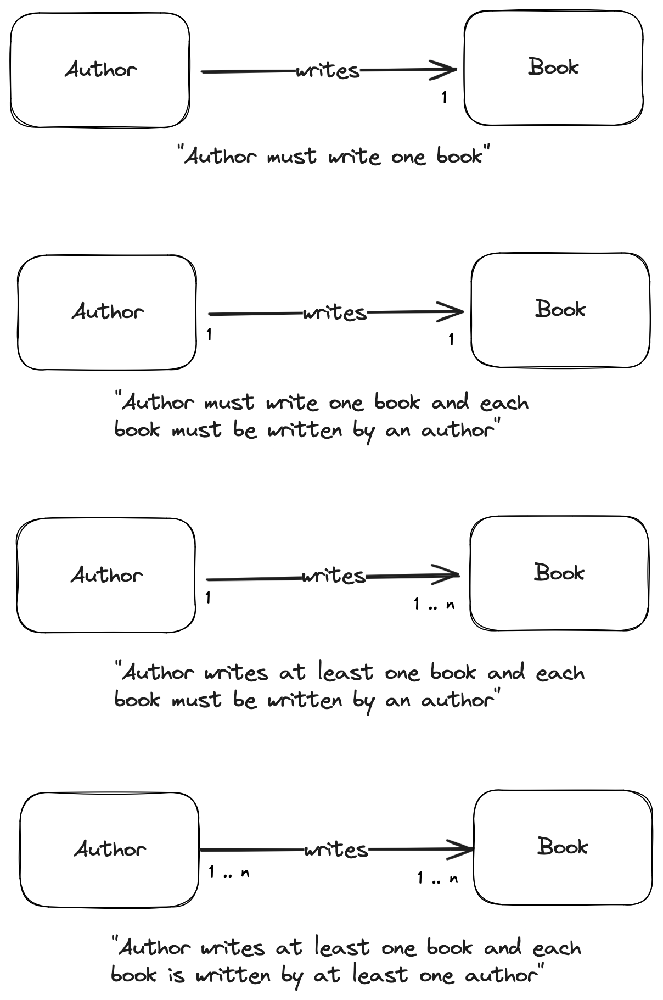
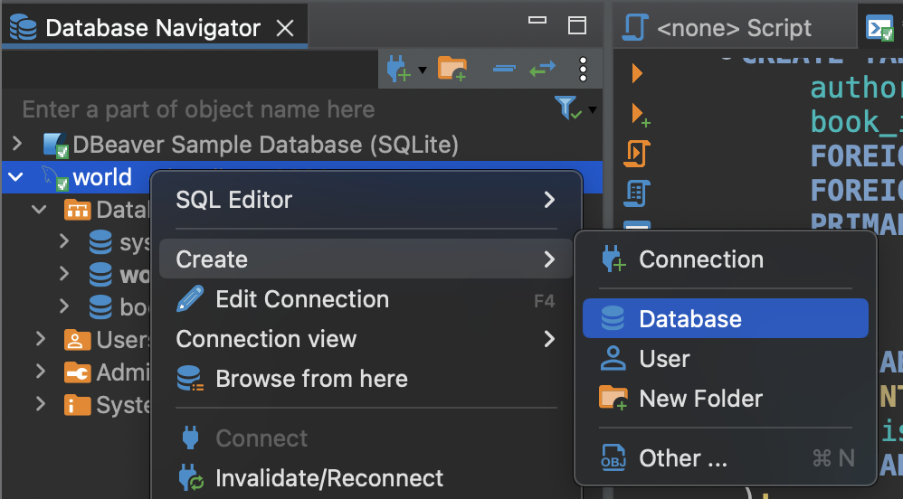
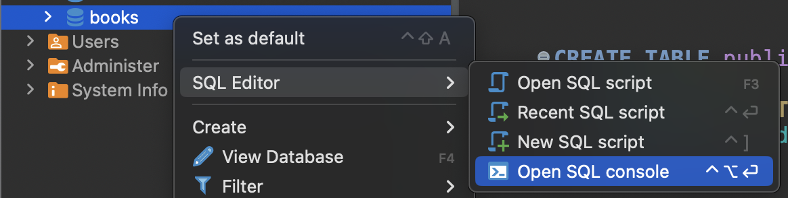

# Week 2


https://xkcd.com/327/

## Topics

- [Constraints](#constraints)
- [Creating your first database](#creating-your-first-database2)

## Constraints<sup>[[1](#references)]</sup>

### Primary Keys 

Let’s return to our example `world` database introduced in [Week 1](../week1/README.md). Recall that we had three tables: `country`, `city`, and `countrylanguage`.

Each of these tables has a column (or set of columns) that uniquely identifies each row of that table:
- `code` from `country`
- `id` from `city`
- `country_code` and `language` from `countrylanguage`

These special columns are called **primary keys**.

Primary keys have a few requirements:
- None of the values can be `NULL`.
- Each value must be unique (that is, you can’t have two countries with the same `code` in the `country` table).
- A table cannot have more than one primary key.

Sometimes, having a single column uniquely identify a row is not enough. In this case, multiple columns can be used together to form a **composite primary key**. That's the scenario we see in the `countrylanguage` table:
- There can be multiple languages per country (so `country_code` could not be a primary key)
- The same language can be used in multiple countries (so `language` could not be a primary key)
- Per each country, we only expect one entry per language. A composite key of `country_code` and `language` is useful

### Foreign Keys

Let’s reexamine the `city` table:

```sql
-- +----+----------------+-------------+---------------+------------+
-- | ID | Name           | CountryCode | District      | Population |
-- +----+----------------+-------------+---------------+------------+
-- |  1 | Kabul          | AFG         | Kabol         |    1780000 |
-- |  2 | Qandahar       | AFG         | Qandahar      |     237500 |
-- |  3 | Herat          | AFG         | Herat         |     186800 |
-- |  4 | Mazar-e-Sharif | AFG         | Balkh         |     127800 |
-- |  5 | Amsterdam      | NLD         | Noord-Holland |     731200 |
-- |  6 | Rotterdam      | NLD         | Zuid-Holland  |     593321 |
-- |  7 | Haag           | NLD         | Zuid-Holland  |     440900 |
-- |  8 | Utrecht        | NLD         | Utrecht       |     234323 |
-- |  9 | Eindhoven      | NLD         | Noord-Brabant |     201843 |
-- | 10 | Tilburg        | NLD         | Noord-Brabant |     193238 |
-- (...)
```

As mentioned earlier in [Week 1 - Combining Tables](../week1/README.md#combining-tables), the values of `city.countrycode` match the values of `country.code` (the primary key for `country`).

When the primary key for one table appears in a different table, it is called a **foreign key**.

So `code` is a primary key when it appears in `country`, but a foreign key when it appears in `city`. The most common types of joins will be joining a foreign key from one table with the primary key from another table.

>[!IMPORTANT]
> When a column is set as a foreign key, its value *must* exist in the original table as a primary key. For example, inserting a row with `countrycode = 'XXX'` into the `city` table is not possible because there's no country with code 'XXX' in the `country` table.

> [!NOTE]
> In the `city` table, the values for column `name` are also unique, so it could also be used as a primary key. However, generally, the primary key will just be called `id`.

### `UNIQUE`, `NOT NULL`, `CHECK`, and `DEFAULT`

Primary keys and foreign keys are the so-called table-level constraints. There are other constraints that apply only to the values of individual columns.

Here are some of the column constraints that can be set:

- `UNIQUE` columns have a different value for every row. This is similar to a primary key except a table can have many different `UNIQUE` columns.
    - For example, the `country.name` can be `UNIQUE` (there shouldn't be 2 countries with the same name), even though `code` is the primary key
- `NOT NULL` columns must have a value. Attempts to insert a row without a value for a `NOT NULL` column will result in a constraint violation and the new row will not be inserted.
    - For example, we may say that `population` of a country is important information and we'd like to prevent having rows that don't set it
- `CHECK` columns allow checking for a condition
    - For example, we could ensure `country.population` must be greater than 0
- `DEFAULT` columns are configured to have a given value automatically set if the new row does not specify a value for that column.
    - For example, we could set `isOfficial` to *true* ('T') whenever a new row is added to `countrylanguage`, if a value is not specified

> [!NOTE]
> We'll talk more about how to set these constraints in the ["Creating your first database"](#creating-your-first-database) section.


## Creating your first database<sup>[[2]](#references)</sup>

In this section, we will learn how to design our own database schemas.

Thus far, we worked with a finished `world` database. Now, we will look under the hood and see what steps can be used to create such a database.

We are tasked with representing a **book review website** through a database schema. This includes the books, authors, translators, publishers, and book ratings.

To break down the question further, we need to decide…
- what kinds of tables we will have in our 'books' database,
- what columns each of the tables will have, and
- what types of data we should put in each of those columns.

### Types of Relationships

Let us look at some different ways in which tables can be related to each other in relational databases.

Consider this case, where each author writes only one book and each book is written by one author. This is called a one-to-one relationship.


On the other hand, if an author can write multiple books, the relationship is a **one-to-many relationship**.


But actually, neither of those reflect reality. Not only can one author write multiple books, but books can also be co-written by multiple authors. This is a **many-to-many** relationship.


> [!IMPORTANT]
> There are 3 types of relationships in the relational model:
> - **one-to-one** relationships
> - **one-to-many** relationships
> - **many-to-many** relationships

### Entity Relationships Diagrams

We just described one-to-one, one-to-many, and many-to-many relationships between tables in a database. It is possible to visualize such relationships using an entity relationship (ER) diagram.

ER diagrams are a useful way to design and explain the conceptual model for a database before creating the database itself. ER diagrams are easy to understand even without a technical background. 

Also, it's relatively simple to convert ER diagrams to the Relational Model (that is, to a SQL representation). Therefore, when designing a relational database, it's common to start by mapping an ER diagram.

Here's an ER diagram for the `book review` problem:



Each entity (Author, Publisher, etc.) will be a table in our database. The relationship between the tables, or entities, is represented by the *verbs* that mark the arrows connecting entities.

The diagram is following the UML notation (**simplified**):
- `0` - no relations
- `1` - one relation
- `n` - many relations

These can be used together to represent the 3 types of relationships:
- One-to-many: `n -> 1`
    - Or variants like: `n -> 0..1`
- One-to-one: `1 <-> 1`
    - Or variants like: `0..1 <-> 0..1`
- Many-to-many: `n <-> n`
    - Or variants like: `1..n <-> n`

Here are some examples:



Let's revisit the ER diagram for the `book review` problem:


By observing the lines connecting the Book and Translator entities, we can say that books don't **need** to have a translator (`n <-> 0..n`). However, a translator in this database translates at least one book, and possibly many.

Let's see if you got it! Try to answer the following questions:
- How many ratings can each book have?
- Must each publisher have published at least 1 book?
- Can a book be published by more than one publisher?
- Can a book have a single translator?

<details>
<summary>View solution</summary>

- How many ratings can each book have?
    - Zero or more (`0..n`)
- Must each publisher have published at least 1 book?
    - Yes. The relationship `Publisher <-> Book` has `1 .. n` on the Book side
- Can a book be published by more than one publisher?
    - No. The relationship `Publisher <-> Book` has `1` on the Publisher side
- Can a book have a single translator?
    - Yes. It can also have no translator or many
</details>

> [!TIP]
> The exact relationships between entities are up to the designer of the database. For example, whether each author can write only one book or multiple books is a decision to be made while designing the database. An ER diagram can be thought of as a tool to communicate these decisions to someone who wants to understand the database and the relationships between its entities.

### Converting to the Relational Model

Once we know that a relationship exists between certain entities, we need to implement that in our database. For that, we'll use [primary keys](#primary-keys) and [foreign keys](#foreign-keys).

Let's start with primary keys. For each entity/table, we'll assign them a unique `id` column. Here's an example `books` table:


Now we need to map the relationships. We do that with the help of **foreign keys**.

For each type of relationship (one-to-many, one-to-one, many-to-many) there's a way to convert them to the relational model (a SQL table).

#### One-to-many

To represent the relationship between Books and Ratings, we add the primary key of `books` as a column in the `ratings` table. This helps form a one-to-many relationship between the two tables — a book with a title (found in the `books` table) can have multiple ratings (found in the `ratings` table).

Here's the `books` and `ratings` table:


> [!IMPORTANT]
> `id` is a primary key in `books`, but `book_id` is a foreign key in `ratings`.

#### Many-to-many

To represent the relationship between Books and Authors, we create a separate table - `authored`. This table maps the primary key of `books` - `book_id` with the primary key of `authors` - `author_id`. 

This helps form a many-to-many relationship between the two original tables - an author (found in the `authors` table) can write multiple books (found in the `books` table), represented in the `authored` table by the multiple entries with their `author_id`. Simultaneously, a book can be written by multiple authors, found in the `authored` table as multiple entries with the same `book_id`.

Finally, `author_id` and `book_id` together form the (*composite*) primary key of the `authored` table. This uniquely identifies the relationship and ensures that an author can't be related to the same book more than once, and vice versa.

Here's the `books`, `authors`, and `authored` tables:


> [!TIP]
> Tables like `authored` are called “joint” or “junction” tables.

> [!NOTE]
> There is no one-to-one relationship in our ER diagram. See the [Appendix](#appendix) for an example of how to store such a relationship in your tables.

**It's your turn!**

Based on the ER diagram, design the tables to represent **the relationship between Books and Publishers**. In this exercise, for the Publishers, we just need to store their name.

Hint - you will need:
- a `publishers` table
- to make changes to the `books` table

<details>
<summary>View solution</summary>
<br>

Create `publishers` table:
- **Primary Key**: `id`

Alter `books` table:
- Add column `publisher_id`, foreign key to `publishers` 


</details>

> [!NOTE]
> The process of separating our data in this manner is called **normalizing**. When normalizing, we put each entity in its own table—as we did with authors, books, and others. Any information about a specific entity, for example an author's name, goes into the entity’s own table.

### Data types and constraints

So far we've been focusing on the relationships between our tables. That's a purposeful choice - relationships are hard to change once they're in place, so it's important to get them right and make sure they match our problem.

However, we also need to think about what data we're storing in our tables - *data types* - and to think of what restrictions we want to impose on them - *constraints*.

SQL supports a range of data types across widely used classes of data, such as the following:
- Numeric types
- String or character types
- Temporal types for dates and times

These data types are found across all flavors of SQL (for example SQLite, and PostgreSQL). However, some versions of SQL may support several distinct data types of a particular class while others may only have one.

For example, MySQL has the following options to *just* represent integer values (numbers without decimal points): `INTEGER`, `INT`, `SMALLINT`, `TINYINT`, `MEDIUMINT`, `BIGINT` <sup>[[3](#references)]</sup>.

For now, we'll use the most flexible options:
- **numeric**: `INTEGER` for integers (for example - `21`), `DECIMAL` for numbers with decimal points (for example - `21.02`)
- **string**: `TEXT`
- **date and time**: `DATE` for dates (`2024-06-13`), `DATETIME` for dates with time (`2024-06-13T20:59:56.756Z`)

For example, we could store:
- `author.name` as `TEXT`
- `ratings.score` as `INTEGER`
- `book.published_on` as `DATE`

After we've decided on which data types to use for all columns, we need to think about how to *restrict* them using **constraints**. We usually do this according to what makes sense in our domain.

For example, we can set:
- `book.isbn` as `UNIQUE` (no 2 books have the same ISBN) and `NOT NULL` (a book *must* have an ISBN)
- `book.published_on` with a `DEFAULT` of "today"
- `ratings.score` with a `CHECK` constraint ensuring `score` is between `0` and `5`

Now it's your turn! Let's assume that as part of our database we want to store:
- Authors' date of birth
- The price of each book (*must* have)
- The date and time of when a rating was submitted

For these 3 examples, what *data types* and *constraints* (if any) would you set?

<details>
<summary>View solution</summary>

- Authors' date of birth
    - Answer: `authors.date_of_birth` as `DATE` or `YEAR` (if only storing the year)
- The price of each book (*must* have)
    - Answer: `books.price` as `DECIMAL` (prices may have decimals values) or `INTEGER` for higher precision for arithmetics. Also a `NOT NULL` constraint
- The date and time of when a rating was submitted
    - Answer: `ratings.published_on` as `DATETIME`. Also a `DEFAULT` value of *now()* in

</details>

### Creating the tables in SQL - `CREATE TABLE`

> [!IMPORTANT]
> To follow along this section, create a new MySQL database. In DBeaver, you can do that in `Database Navigator -> world -> Databases -> Create -> Database`
>
> 
> 
> Give a name to your database (for example, `books`) and open a new SQL console:
>
> 

We now have a better idea of the schema of our tables, so we can finally go ahead and create them.

In SQL, to create a table in our database we use the `CREATE TABLE` command:

```sql
CREATE TABLE table_name (
  column_name data_type optional_constraint,
  column_name data_type optional_constraint,
  -- ...
);
```

For example, to create the `authors` and `books` tables:

```sql
CREATE TABLE authors (
    id INTEGER,
    name TEXT NOT NULL,
    country TEXT,
    date_of_birth DATE,
    PRIMARY KEY (id)
);

CREATE TABLE books (
    id INTEGER, 
    isbn TEXT NOT NULL,
    title TEXT, 
    pages INTEGER,
    published_on DATE,
    PRIMARY KEY(id)
);
```

Notice we're setting the `NOT NULL` constraint on `authors.name` and setting `authors.id` (and `books.id`) as primary keys.

We can now create the `authored` table:

```sql
CREATE TABLE authored (
    author_id INTEGER,
    book_id INTEGER,
    FOREIGN KEY(author_id) REFERENCES authors(id), 
    FOREIGN KEY(book_id) REFERENCES books(id),      
    PRIMARY KEY (author_id, book_id)
);
```

Books and authors are now connected in a *many-to-many* fashion, thanks to both foreign keys.

> [!TIP]
> Running `CREATE TABLE` on a table that already exists results in an error. If you make a mistake and want to recreate a table **you must first drop it**.
> ```sql
> DROP table books:
> ```
> Keep in mind this will **delete all data in the table, and its schema.

You may be wondering, what about `publishers`? We should also set up a *one-to-many* relationship between Publishers and Books, but we have already created our `books` table.

That is not a problem - we can *alter* a table's schema via the `ALTER TABLE` command. First, we create the `publishers` table:

```sql
CREATE TABLE publishers (
    id INTEGER,
    publisher TEXT,
    PRIMARY KEY(id)
);
```

Now, we can *alter* the `books` table to include its publisher - `publisher_id`, via a foreign key to `publishers`.

```sql
ALTER TABLE books ADD COLUMN publisher_id INTEGER;
ALTER TABLE books ADD FOREIGN KEY (publisher_id) REFERENCES publishers(id);
```

**It's your turn!**

Write the `CREATE TABLE` command to create the `ratings` table. Remember to ensure the rating amount is valid. Hint: [here's](https://www.w3schools.com/mysql/mysql_check.asp) how to create a `CHECK` constraint.

<details>
<summary>View solution</summary>

```sql
CREATE TABLE ratings (
    book_id INTEGER,
    rating INTEGER CHECK (rating > 0 and rating <= 5),
    FOREIGN KEY(book_id) REFERENCES books(id)
);
```

</details>

To see the complete schema definition including some example data, check the [`databases/books.sql`](./databases/books.sql).

> [!TIP]
> To import the file into your MySQL database, run the following while at the root of the repository:
> ```shell
> $ mysql -u "<your-username>" -p < "week2/databases/books.sql" # enter your password when asked
> ```

## Summary

You just learned how to create your first database in a way that matches a real world problem.

In summary:

#### Keys and Constraints
- Primary Keys: a unique identifier for each row in a table. 
- Foreign Keys: values in a foreign key column must exist in the original table's primary key column
- Column Constraints
    - `UNIQUE`: Ensures all values in a column are different
    - `NOT NULL`: Ensures a column cannot have a NULL value
    - `CHECK`: Ensures values in a column meet a specific condition
    - `DEFAULT`: Sets a default value for a column if none is provided

#### Creating a Database
- Types of Relationships
    - One-to-one
    - One-to-many
    - Many-to-many
- Entity Relationship Diagrams 
    - Visual tool for mapping relationships between tables
    - Can be easily converted to the relational model (using primary and foreign keys)
- Creating Tables in SQL
    - Choose data types and constraints
    - Use `CREATE TABLE` and `ALTER TABLE` commands if needed

## What's next?

That's it for Week 2's theoretical content. Next, you should focus on the [exercises for this week](./EXERCISES.md).

## References

[1] Adapted from Codecademy's ["Learn SQL"](https://www.codecademy.com/enrolled/courses/learn-sql) course

[2] Adapted from [CS50’s Introduction to Databases with SQL](https://cs50.harvard.edu/sql/2024/notes/2/)

[3] https://dev.mysql.com/doc/refman/8.4/en/integer-types.html

## Appendix

TOO add one-to-one example