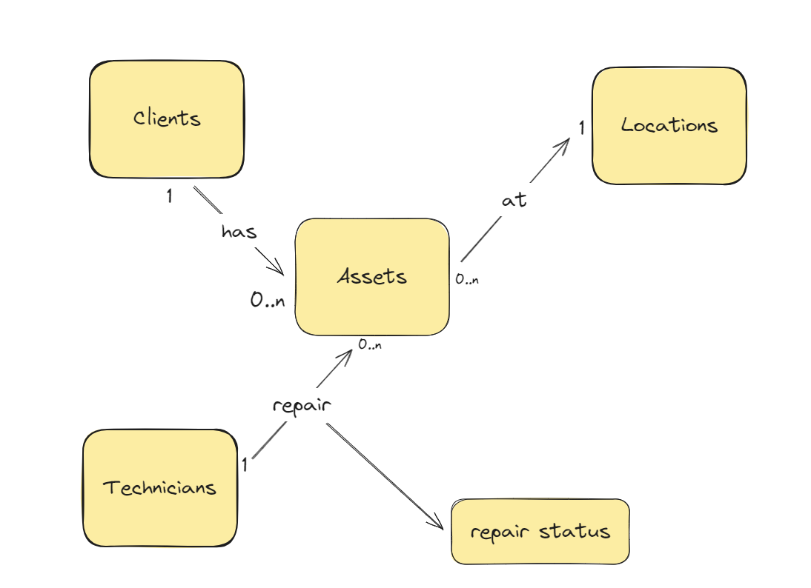
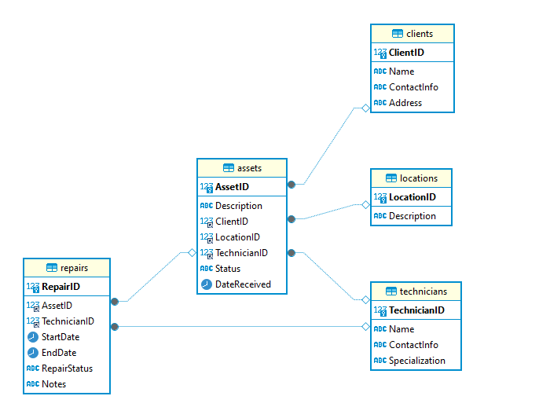
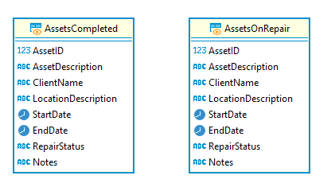

# Design Document - "Assets Status Follow-up"

By Amira Bayoumi

## Scope

* Purpose of the Database:
The purpose of this database is to track and manage the process of repairing assets. This includes monitoring the status of each asset, ensuring efficient follow-up on the repair progress, and knowing the current location of the assets.

* In-Scope Entities:
Technicians - Individuals responsible for repairing the assets.
Clients - Owners or users of the assets.
Assets - Items that require repair.
Location - Places where the assets are located or where the repairs take place.

* Out-of-Scope Entities:
Managers - Individuals who oversee operations but are not directly involved in the repair process.
Other Employees - Staff members who are not directly involved in asset repair.
Shipping - Logistics related to the transportation of assets, which is not tracked within this database.

## Functional Requirements

1- **Track Asset Status**:
View the current status of each asset (e.g., "Under Repair", "Completed").

2- **Monitor Asset Location**:
View the current location of each asset.
Update the location of an asset if it is moved.

3- **View Technician Information**:
View a list of technicians with their contact details and specializations.
View repair activities assigned to a specific technician.

4- **Manage Client Information**:
Add, update, and view client information.
View assets associated with each client.

5- **Generate Reports**:
Generate reports on assets under repair, repair history, technician assignments, and asset locations.

6- **Search**:
Search for assets by status, location, or client.
Search for repair activities by technician or asset.

### Entities and Relationships



**Description of Relationships:**

 Clients (1) ↔ (M) Assets:
A client can own multiple assets.
Each asset belongs to one client.

  Locations (1) ↔ (M) Assets:
A location can house multiple assets.
Each asset is located at one location.

 Technicians (1) ↔ (M) Assets:
A technician can perform  **repairs** on many assets.
Each Assets is performed by one technician.

## Representation

### Entities



Entities are captured in MySQL tables with the following schema.

**Tables**
The database includes the following tables:

**Clients Table:** Stores client information
Includes :
1- *ClientID* is an `INT` column that automatically increments `AUTO_INCREMENT`and It is `primary key`, ensuring each client has a unique identifier.
2- *Name* is `VARCHAR` with `NOT NULL` constraint ensures that this column must contain a value, preventing the insertion of records without a client name.
3- *Contact info and  address* both are `VARCHAR` without constraint.

**Locations Table**: Stores location information where assets are located
Includes:
 1- *LocationID* is `INT` , set as the `primary key`, ensuring each location has a unique identifier, with `NOT NULL` constraint ensures that this column must contain a value.
 2- *Description* is a  `VARCHAR`, it stores optional descriptive information about the location.

**Technicians Table:** Stores technician information
Includes:
1- *TechnicianID* is an `INT`, it is `primary key`, ensuring each technician has a unique identifier.
2- *Name* is `VARCHAR`and with `NOT NULL` constraint ensures that every technician record must have a name, preventing the insertion of records without a technician name
3- *ContactInfo* `VARCHAR`, It stores optional contact information such as phone numbers or emails.
4- *Specialization* is a `VARCHAR`, It stores information about the technician's area of expertise or specialization.

**Assets Table:** Stores asset information.
Includes:
1- *AssetID* is an `INT` column that auto-increments `AUTO_INCREMENT`, it serves as the `primary key`, ensuring each asset has a unique identifier.
2- *Description* is a `TEXT` that stores detailed information about the asset. and `NOT NULL`constraint ensures that this column must contain a value, preventing the insertion of records without a description.
2- *Status* is a `VARCHAR` it stores the current status of the asset (e.g., "Under Repair", "Completed").
3- *DateReceived* is a  `DATE` that records the date the asset was received for repair.
4- *ClientID* , *TechnicianID* and *LocationID* are `foreign keys` referencing the owner Client and Locations tables and the Technician who responsible of repair this asset.

**Repairs Table:** Stores repair status of assets
includes:
1- *RepairID* is an `INT`column that auto-increments `AUTO_INCREMENT`, It serves as the `primary key`, ensuring each repair record has a unique identifier.

2- *StartDate* is a `DATE` that records the start date of the repair if exist.
3- *EndDate* is a `DATE` that records the end date of the repair if exist.

4- *RepairStatus* is a `VARCHAR` and `NOT NULL` constraint ensures that this column must contain a value, recording the current status of the repair (e.g., "In Progress", "Completed").

5- *Notes* is a `text`  that stores detailed notes about the repair.

6- *AssetID* and  *TechnicianID* are `foreign keys` referencing the Assets that belong to this repair record and to the technician responsible for the repair.

## Optimizations

**Views:**

To simplify queries and provide a fast way to access Assets Repair status, the following views were created:


  View for Assets Currently Under Repair:

```sql
CREATE VIEW AssetsOnRepair AS
SELECT 
    Assets.AssetID, 
    Assets.Description, 
    clients.Name AS ClientName, 
    locations.Address AS LocationAddress, 
    repairs.StartDate, 
    repairs.EndDate, 
    repairs.RepairStatus, 
    repairs.Notes
FROM Assets a
JOIN Clients c ON Assets.ClientID = clients.ClientID
JOIN Locations l ON Assets.LocationID = locations.LocationID
JOIN Repairs r ON Assets.AssetID = Repairs.AssetID
WHERE Assets.Status = 'Under Repair';
```

>> This view provides a straightforward way to see all assets currently under repair, including relevant details from the Assets, Clients, Locations, and Repairs tables.
View for Completed Repairs:
---

```sql

CREATE VIEW AssetsCompleted AS
SELECT 
    Assets.AssetID, 
    Assets.Description AS AssetDescription, 
    Clients.Name AS ClientName, 
    locations.Address AS LocationAddress, 
    repairs.StartDate, 
    repairs.EndDate, 
    repairs.RepairStatus, 
    repairs.Notes
FROM Assets a
JOIN Clients c ON Assets.ClientID = Clients.ClientID
JOIN Locations l ON Assets.LocationID = Locations.LocationID
JOIN Repairs r ON Assets.AssetID = repairs.AssetID
WHERE Assets.Status = 'Completed';
```

>>This view offers a simple way to access information about all completed repairs, integrating data from the Assets, Clients, Locations, and Repairs tables.

## Limitations

1- The design only includes clients, locations, technicians, assets, and repairs.
It does not account for other potentially relevant entities such as suppliers, parts inventory, or repair costs.
>>This might limit the ability to track the full lifecycle of repairs, including parts used and costs incurred.
