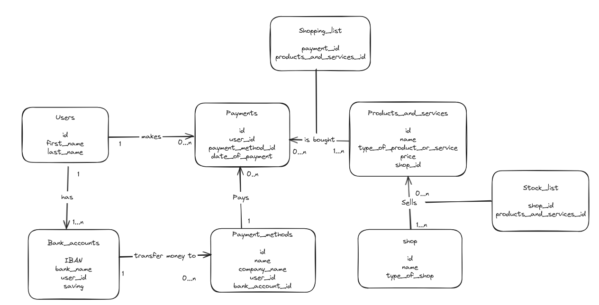

# Design Document - "Payment History"

By Hitomi

## Scopes

The database for the Payment History includes all entities necessary to facilitate the process of tracking payment histories. As such, included in the database's scope is:

* Payment_services, including basic identifying information
* Payments, including the time at which the payment was made, the type of the payment(card, cash, bank transfer etc), the price
* Bank_accounts, including basic identifying information
* Users, including basic identifying information
* Product_and_services, including basic information about which shop sold the products or services, type of products and services
* Shops, which includes basic identifying information

Out of scope are elements like payment method in details(for example for cards, touch or insert), date of withdrawal,
which payment service is accepted by the shops and other non-core attributes.

## Functional Requirements

This database will support:

* Operations to create, read, update and delete users and payments
* Tracking all payments which is made by users, including multiple payments for the same shops and which payment type the users used

The system will **not** support:

* Information about payment services like card number
* Information about which payment service the user can use at which shop

### Entities and Relationships

In this section you should include your entity relationship diagram and describe the relationships between the entities in your database.

The below entity relationship diagram describes the relationships among the entities in the database.

As detailed by the diagram:

* One user is capable of making 0 to many payments. 0, if they have not paid anything, and many if they purchased more than one product or service. A payment is made by only one user.
* A payment is paid with one and only one payment method. Meanwhile, a payment method can be used for 0 to many payments: 0 if no payment have yet made, and many if more than one payment has been made with that payment method.
* One user is capable of having 1 to many bank accounts. 1 to many if they have one or more accounts. A bank account is held by only one user.
* A bank account can have 0 to many payment methods. 0, if they have not connected to any payment methods, and many if they are connected to many payment methods.A payment method has only one bank account.
* A products or service can be seen in 0 to many payments. 0 if the product or service is not purchased, and many if multiple purchase of the product or service occurred in a payment. A payment can have 1 to many products and services.
* A shop can sell 0 to many products and services: 0 if they run out of all the stocks, and many if they have multiple stuffs to sell. Products and services can be sold in 1 to many shops.

## Representation

Entities are captured in MySQL tables with the following schema.

### Entities

In this section you should answer the following questions:

* Which entities will you choose to represent in your database?
* What attributes will those entities have?
* Why did you choose the types you did?
* Why did you choose the constraints you did?

### Tables

The database includes the following tables:

#### Users

The `users` table includes:

* `id`, which specifies the unique ID for the user as an `INTEGER`. This column thus has the `PRIMARY KEY` constraint applied.
* `first_name`, which specifies the user's first name as `VARCHAR(255)`. Using `TEXT` is also appropriate but we to limit the maximum length of name fields.
* `last_name`, which specifies the user's last name. `VARCHAR(255)` is used for the same reason as `first_name`.

All columns are required and hence have the `NOT NULL` constraint applied where a `PRIMARY KEY` or `FOREIGN KEY` constraint is not.

#### Payments

The `payments` table includes:

* `id`, which specifies the unique ID for the payment as an `INTEGER`. This column thus has the `PRIMARY KEY` constraint applied.
* `user_id`, which specifies the ID of the user who made the payment. This column thus has the `FOREIGN KEY` constraint applied, referencing the `id` column in the `users` table, which ensures that each payment be referenced back to an user.
* `payment_method_id`, which specifies the ID of the payment method used for this payment. This column thus has the `FOREIGN KEY` constraint applied, referencing the `id` column in the `payment_methods` table, which ensures that each payment be referenced back to a payment_method.
* `date_of_payment`, which specifies the date of the payment as `date`. The default value for the `date_of_payment` attribute is the current date, as denoted by `DEFAULT (CURRENT_DATE)` statement.
* `price`, which specifies the sum of the payment as `INTEGER`.

All columns are required and hence have the `NOT NULL` constraint applied where a `PRIMARY KEY` or `FOREIGN KEY` constraint is not.

#### Bank_accounts

The `bank_accounts` table includes:

* `IBAN`, which specifies the unique IBAN for the bank_account as an `INTEGER`. This column thus has the `PRIMARY KEY` constraint applied.
* `bank_name`, which is the name of the bank set as `VARCHAR(255)`.
* `user_id`, which specifies the ID of the user who has the bank account. This column thus has the `FOREIGN KEY` constraint applied, referencing the `id` column in the `users` table, which ensures that each bank account be referenced back to an user.
* `saving`, which specifies the amount of the saving in the bank account as INTEGER.

All columns in the `problems` table are required, and hence should have the `NOT NULL` constraint applied. No other constraints are necessary.

#### Payment_methods

The `payment_methods` table includes:

* `id`, which specifies the unique ID for the method as an `INTEGER`. This column thus has the `PRIMARY KEY` constraint applied.
* `name`, which is the name of the payment method set as `VARCHAR(255)`.
* `company_name`, which is the name of the company who provides the payment method set as `VARCHAR(255)`.
* `user_id`, which specifies the ID of the user who has the payment method. This column thus has the `FOREIGN KEY` constraint applied, referencing the `id` column in the `users` table, which ensures that each payment method be referenced back to an user.
* `bank_account_id`, which is the ID of the bank_account which is connected to the payment method as an `INTEGER`. This column thus has the `FOREIGN KEY` constraint applied, referencing the `id` column in the `bank_accounts` table to ensure data integrity.

All columns are required and hence have the `NOT NULL` constraint applied where a `PRIMARY KEY` or `FOREIGN KEY` constraint is not.

#### Products_and_services

The `products_and_services` table includes:

* `id`, which specifies the unique ID for the product or service as an `INTEGER`. This column thus has the `PRIMARY KEY` constraint applied.
* `name`, which is the name of the product or service set as `VARCHAR(255)`.
* `type_of_product_or_service`, which specifies the type of the purchased set as `VARCHAR(255)`.
* `price`, which specifies the price of the product or service as `INTEGER`.
* `shop_id`, which specifies the ID of the shop who sells the product or service. This column thus has the `FOREIGN KEY` constraint applied, referencing the `id` column in the `shops` table, which ensures that each product or service be referenced back to a shop.

All columns are required and hence have the `NOT NULL` constraint applied where a `PRIMARY KEY` or `FOREIGN KEY` constraint is not.

#### Shops

The `shops` table includes:

* `id`, which specifies the unique id for the shop as an `INTEGER`. This column thus has the `PRIMARY KEY` constraint applied.
* `name`, which is the name of the shop set as `VARCHAR(255)`.
* `type_of_shop`, which specifies the type of the shop set as `VARCHAR(255)`.

All columns in the `shops` table are required, and hence should have the `NOT NULL` constraint applied. No other constraints are necessary.

## Optimizations

It is common for the user of this database to know which user bought which products or services. Also, for managing the access to users' personal information like IBAN, 'user_products_and_services' view is created.

It is common for users of the database to access all products and services sold in any particular shops. For that reason, indexes are cerated on the 'name' columns to speed the identification of shops by those columns.

## Limitations

The current schema assumes all the shops accepts all the type of payment method. Restriction of the payment methods would require explicit entity.