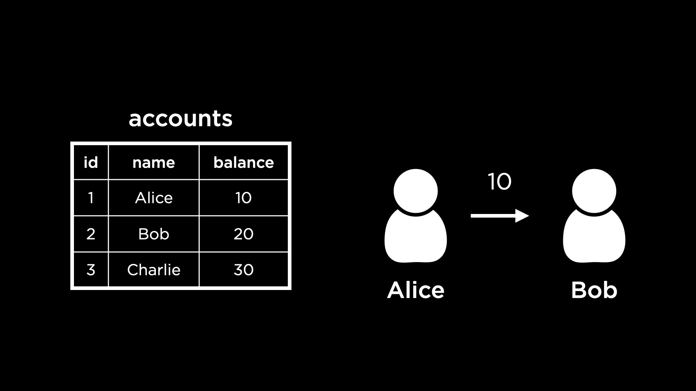

# Week 3


https://xkcd.com/1409/

## Topics

- [Writing data](#writing-data)
- [Views](#views)
- [Triggers](#triggers)
- [Transactions](#transactions)
- [Access Controls](#access-controls)

## Manipulating data

> [!TIP]
> In this section we'll use the `books` database introduced in [Week 2](../week2/README.md) throughout the examples
> To reset the `books` database into it's original state, run the following command in a terminal:
> ```shell
> $ mysql -u "root" -p < "week2/databases/books.sql" # replace 'root' with your user
> ``` 

Here is a snapshot of tables from the `books` database:


#### Inserting Data

The SQL statement `INSERT INTO` is used to insert a row of data into a given table. For example, to insert a row in the `authors` table:

```sql
INSERT INTO authors (id, name, country, date_of_birth) VALUES (16, 'Manuel Paulo', 'Portugal', '1927-03-06'),
-- Query OK, 1 row affected (0,00 sec)
```

We can see that this command requires the list of columns in the table that will receive new data and the values to be added to each column, in the same order.

We can run a query to confirm that the row is now present in `authors`:

```sql
SELECT * FROM authors WHERE name = 'Manuel Paulo'

-- +----+--------------+----------+---------------+
-- | id | name         | country  | date_of_birth |
-- +----+--------------+----------+---------------+
-- | 16 | Manuel Paulo | Portugal | 1927-03-06    |
-- +----+--------------+----------+---------------+
-- 1 row in set (0,00 sec)
```

We can add more rows to the database by inserting multiple times. 

However, typing out the value of the `id` column manually (as 1, 2, 3 etc.) might result in errors. Since we've set the `id` column as `AUTO_INCREMENT`, MySQL can fill out the column values automatically. To make of this functionality, we omit the `id` column when inserting a new row:

```sql
INSERT INTO authors (name, country, date_of_birth) VALUES ('Cory Doctorow', 'Canada', '1971-07-17'),
-- Query OK, 1 row affected (0,00 sec)

SELECT * FROM authors WHERE NAME = 'Cory Doctorow'
-- +----+---------------+---------+---------------+
-- | id | name          | country | date_of_birth |
-- +----+---------------+---------+---------------+
-- | 17 | Cory Doctorow | Canada  | 1971-07-17    |
-- +----+---------------+---------+---------------+
-- 1 row in set (0,01 sec)
```

> [!NOTE] 
> When using `AUTO_INCREMENT` MySQL fills out the primary key values by incrementing the previous primary key - in this case, 16.

> [!TIP]
> We can insert multiple rows at by separating the rows using commas:
> ```sql
> INSERT INTO authors (name, country, date_of_birth) 
> VALUES 
> ('David Graeber', 'United States of America', '1999-01-01'),
> ('McKenzie Wark', 'Australia', '1961-09-10'),
> ('Fernando Pessoa', 'Portugal', '1888-06-13');
> -- Query OK, 3 rows affected (0,00 sec)
> -- Records: 3  Duplicates: 0  Warnings: 0
> ```

#### Updating data

We can easily imagine scenarios in which data in a database would need to be updated. For example, in the `books` database, an author's date of birth may have been incorrectly set.

We can use the `UPDATE` command to update the `authors` table with David Graeber's correct date of birth:

```sql
UPDATE authors
SET date_of_birth = '1961-12-01'
WHERE name = 'David Graeber';

-- Query OK, 1 row affected (0,00 sec)
-- Rows matched: 1  Changed: 1  Warnings: 0
```
The first part of this query specifies the table to be updated. The next part specifies the column we're updating and its new value. The last part selects the row(s) in `authors` which will be updated - author(s) with `name` David Graeber.

#### Deleting data

Besides updating, we can also delete rows that match specific conditions. For example, to delete David Graeber from the `authors` table we can run:

```sql
DELETE FROM authors WHERE name = 'David Graeber'
-- Query OK, 1 row affected (0,01 sec)
```

We can use the `WHERE` clause to filter rows in more complex ways, just like in the `SELECT` and `UPDATE` commands. For example, to delete rows pertaining to portuguese authors born before 1900:

```sql
DELETE FROM authors WHERE date_of_birth < '1900-01-01' and country = 'Portugal'
-- Query OK, 1 row affected (0,01 sec)

-- Note: this should delete author Fernando Pessoa
```

> [!WARNING]
> Running a `DELETE` command without a `WHERE` clause **deletes all rows from a table**.
> ```sql
> DELETE FROM authors; -- don't do this
> ```

There might be cases where deleting some data could impact the integrity of a database. Foreign key constraints are a good example. A foreign key column references the primary key of a different table. If we were to delete the primary key, the foreign key column would have nothing to reference.

> [!TIP]
> Here's how we created the `authored` table:
> ```sql
> CREATE TABLE authored (
>   author_id INTEGER,
>   book_id INTEGER,
>   FOREIGN KEY(author_id) REFERENCES authors(id), 
>   FOREIGN KEY(book_id) REFERENCES books(id),      
>   PRIMARY KEY (author_id, book_id)
> );
>```

For example, the primary key of `authors` is a foreign key in the `authored` table (`authored.book_id`) - that's how we represented the many-to-many relationship between Authors and Books.

Given this, if we choose do delete an author that has written at least one book (for example, author with id `2`) - what would happen to the rows in the table `authored` that reference that author (`authored.author_id == '2'`)?

```sql
DELETE FROM authors WHERE id = 2;

-- ERROR 1451 (23000): Cannot delete or update a parent row: a foreign key constraint fails (`books`.`authored`, CONSTRAINT `authored_ibfk_1` FOREIGN KEY (`author_id`) REFERENCES `authors` (`id`))
```

On running this, we get an error notifying us that deleting this data would violate the constraint set up in the `authored` table. 

How do we ensure that the constraint is not violated? One possibility is to delete the corresponding rows from the `authored` table before deleting from the `authors` table.

```sql
DELETE FROM authored WHERE author_id = 2;
-- Query OK, 1 row affected (0,01 sec)
```

This query effectively deletes the author’s affiliation with their book. Once the affiliation no longer exists, we can delete the author’s data without violating the foreign key constraint. The following should now work:

```sql
DELETE FROM authors WHERE id = 2;
-- Query OK, 1 row affected (0,01 sec)
```

Alternatively, we can specify the action to be taken when an id referenced by a foreign key is deleted. To do this, we use the keyword `ON DELETE` followed the action to be taken.

For example, this is how we would create the `authored` schema if we want to **allow** the deletion of ids that are referenced by a foreign key and also proceeds to cascandingly delete the referencing foreign key rows:

```sql
CREATE TABLE authored (
  author_id INTEGER,
  book_id INTEGER,
  FOREIGN KEY(author_id) REFERENCES authors(id) ON DELETE CASCADE, -- set on delete cascade
  FOREIGN KEY(book_id) REFERENCES books(id) ON DELETE CASCADE, -- set on delete cascade     
  PRIMARY KEY (author_id, book_id)
);
```

This would mean that running a `DELETE` statement will not result in an error when trying to delete an author that is linked to a book. Instead, both the entry in the `authors` and `authored` table will be deleted.

> [!IMPORTANT]
> Deciding whether or not to cascade deletions depends on your use case. There are other options for the `ON DELETE` clause in constraints, for example ([MySQL](https://dev.mysql.com/doc/refman/8.4/en/create-table-foreign-keys.html#foreign-key-referential-actions)):
> - `ON DELETE RESTRICT`: (default) restricts us from deleting rows when a foreign key constraint is violated
> - `ON DELETE SET NULL`: allows the deletion of rows when a foreign key is violated and set the foreign key references to `NULL`
> - `ON DELETE SET DEFAULT`: same as the previous but allows to set a default value instead of `NULL`
>

## Views

Thus far, we have learned about concepts that allow us to design complex databases and write data into them. Now, we will explore ways in which to obtain views from these databases.

To find a book written by the author Haruki Murakami, we would need to go each of the three table above — first finding the author’s `id`, then the corresponding book IDs and then the book titles. Instead, is there a way to put together related information from the three tables in a single place?

Yes, we can use the `JOIN` command to combine rows from two or more tables based on a related column between them. Here is a SQL query to answer the question "What books were written by Haruki Murakami?":

```sql
SELECT * FROM authors
JOIN authored ON authored.author_id = authors.id
JOIN books ON authored.book_id = books.id
WHERE authors.name = 'Haruki Murakami';

-- +----+-----------------+---------+---------------+-----------+---------+----+---------------+----------------+-------+--------------+--------------+
-- | id | name            | country | date_of_birth | author_id | book_id | id | isbn          | title          | pages | published_on | publisher_id |
-- +----+-----------------+---------+---------------+-----------+---------+----+---------------+----------------+-------+--------------+--------------+
-- |  2 | Haruki Murakami | Japan   | 1949-01-12    |         2 |       2 |  2 | 9784101001547 | Norwegian Wood |   296 | 1987-09-04   |            2 |
-- +----+-----------------+---------+---------------+-----------+---------+----+---------------+----------------+-------+--------------+--------------+
-- 1 row in set (0,00 sec)
```

This makes it simple to observe that Haruki Murakami authored "Norwegian Wood".

We can also adapt the query to remove the `id` columns, such that the results looks like the following:

```sql
SELECT authors.name, books.title FROM authors -- return only author name and book title
JOIN authored ON authored.author_id = authors.id
JOIN books ON authored.book_id = books.id
WHERE authors.name = 'Haruki Murakami';


-- +-----------------+----------------+
-- | name            | title          |
-- +-----------------+----------------+
-- | Haruki Murakami | Norwegian Wood |
-- +-----------------+----------------+
-- 1 row in set (0,00 sec)
```

The above query is complex. Instead of always writing such query whenever we want to find which books were written by a given author, we can create a **view** - a virtual table - based on the query above using `CREATE VIEW`:

```sql
CREATE VIEW AS author_book_title
SELECT authors.name, books.title FROM authors
JOIN authored ON authored.author_id = authors.id
JOIN books ON authored.book_id = books.id

```

The view created here is called `author_book_title`. This view can now be used exactly as we would use a table in SQL. For example:

```sql
SELECT * FROM author_book_title;

--+------------------------+--------------------------------+
--| name                   | title                          |
--+------------------------+--------------------------------+
--| Gabriel Garcia Marquez | One Hundred Years of Solitude  |
--| Haruki Murakami        | Norwegian Wood                 |
--| George Orwell          | 1984                           |
--| J.K. Rowling           | Harry Potter                   |
--| J.R.R. Tolkien         | The Hobbit                     |
--| F. Scott Fitzgerald    | The Great Gatsby               |
--| Herman Melville        | Moby Dick                      |
-- (...)
-- 15 rows in set (0,01 sec)
```

Using this view, we can considerably simplify the query needed to find the books written by Haruki Murakami.

```sql
SELECT * FROM author_book_title WHERE name = 'Haruki Murakami';
-- +-----------------+----------------+
-- | name            | title          |
-- +-----------------+----------------+
-- | Haruki Murakami | Norwegian Wood |
-- +-----------------+----------------+
-- 1 row in set (0,00 sec)
```

> [!IMPORTANT]
> A view is a virtual table defined by a query. They can be helpful in various scenarios:
> - simplifying: putting together data from different tables to be queried more simply,
> - aggregating: running aggregate functions, like finding the sum, and storing the results,
> - partitioning: dividing data into logical pieces,
> - securing: hiding columns that should be kept secure. While there are other ways in which views can be useful, in this lecture we will focus on the above four.

A view, being a virtual table, does not consume much more disk space to create. The data within a view is still stored in the underlying tables, but still accessible through this simplified view.

> [!IMPORTANT]
> Views cannot be updated because views do not have any data in the way that tables do. Views actually pull data from the underlying tables each time they are queried. 
> This means that when an underlying table is updated, the next time the view is queried, it will display updated data from the table.

Views can be also used to enhance database security by limiting access to certain data.

Imagine we want to share `books` data with an analyst, whose job is to find the most popular authors. Let's assume it would be irrelevant and, indeed, not secure to give them the date of birth of individual authors - it's personal data.

Views can be handy in this situation — we can share with the analyst a view containing the author information, but not their date of birth or other sensitive data.

We can even go one step further and return a `date_of_birth` column with a redacted value. This indicates to the analyst that we have `date_of_birth` data in the database, but it has been redacted for security.

```sql
CREATE VIEW authors_analysis as 
SELECT id, name, country, 'redacted' as date_of_birth from authors;
```

We can now query this view:

```sql
SELECT * FROM authors_analysis;

-- +----+------------------------+----------------+---------------+
-- | id | name                   | country        | date_of_birth |
-- +----+------------------------+----------------+---------------+
-- |  1 | Gabriel Garcia Marquez | Colombia       | redacted      |
-- |  2 | Haruki Murakami        | Japan          | redacted      |
-- |  3 | George Orwell          | United Kingdom | redacted      |
-- |  4 | J.K. Rowling           | United Kingdom | redacted      |
-- |  5 | J.R.R. Tolkien         | United Kingdom | redacted      |
-- (...)
-- 15 rows in set (0,00 sec)
```

> [!TIP]
> Views created with `CREATE VIEW` will be added to the database schema. 
> To create views that are *not* stored in the database schema, we can use `CREATE TEMPORARY VIEW`. This creates a view that exists only for the duration of our connection to the database. 

## Triggers

Triggers execute a specified function when certain operations are performed on the table (`INSERT`, `UPDATE`, `DELETE`, `TRUNCATE`). 

For example, this can be useful to keep track of changes. Let's say we want to keep track of when an author changes their `date_of_birth`, to monitor if it's just a mistake or potentially bad data. We'll keep this in a new table `authors_date_of_birth_audit`.

First, we create the `authors_date_of_birth_audit` table:

```sql
CREATE TABLE authors_date_of_birth_audit (
	id INT AUTO_INCREMENT,
	author_id INT,
	date_of_birth TEXT,
	updated_at DATE,
	PRIMARY KEY(id),
	FOREIGN KEY(author_id) REFERENCES authors(id)
);
```

Then, we create the trigger with `CREATE_TRIGGER`:

```sql
-- Upon INSERT operation on authors table, add date_of_birth to audit table
CREATE TRIGGER insert_authors_date_of_birth_audit
AFTER INSERT ON authors
FOR EACH ROW
BEGIN
  INSERT INTO authors_date_of_birth_audit (author_id, date_of_birth, updated_at)
  VALUES (NEW.id, NEW.date_of_birth, CURRENT_DATE);
END;
```

Then we try inserting a new author:

```sql
INSERT INTO authors (id, name, country, date_of_birth) VALUES (16, 'Manuel Paulo', 'Portugal', '1883-07-03');
```

We should see the `date_of_birth` value in both `authors` and `authors_date_of_birth_audit` tables:

```sql
SELECT * FROM authors WHERE NAME = 'Manuel Paulo';

-- +----+--------------+----------+---------------+
-- | id | name         | country  | date_of_birth |
-- +----+--------------+----------+---------------+
-- | 16 | Manuel Paulo | Portugal | 1883-07-03    |
-- +----+--------------+----------+---------------+

SELECT * FROM authors_date_of_birth_audit;

-- +----+-----------+---------------+------------+
-- | id | author_id | date_of_birth | updated_at |
-- +----+-----------+---------------+------------+
-- |  1 |        16 | 1883-07-03    | 2024-06-20 |
-- +----+-----------+---------------+------------+
```

What happens if we update an author's date of birth now? 

Actually, that isn't covered by by our trigger. Notice the trigger was created with the `AFTER INSERT ON authors` statement, meaning it is only executed if a new row is inserted in the `authors` table.

To keep track of updates to the name, we need to add a new trigger:

```sql
CREATE TRIGGER update_authors_date_of_birth_audit
AFTER UPDATE ON authors
FOR EACH ROW
BEGIN
  -- Check if the date_of_birth was actually changed
  IF OLD.date_of_birth != NEW.date_of_birth THEN
    INSERT INTO authors_date_of_birth_audit (author_id, date_of_birth, updated_at)
    VALUES (NEW.id, NEW.date_of_birth, CURRENT_DATE);
  END IF;
END;
```

Now if we update Manuel Paulo's date of birth:

```sql
UPDATE authors SET date_of_birth = '1954-01-01' WHERE id = 16;
```

We can see the updated `date_of_birth` in the `authors` table, and the full history of updates in the `update_authors_date_of_birth_audit` table:

```sql
SELECT * FROM authors WHERE NAME = 'Manuel Paulo';

-- +----+--------------+----------+---------------+
-- | id | name         | country  | date_of_birth |
-- +----+--------------+----------+---------------+
-- | 16 | Manuel Paulo | Portugal | 1954-01-01    | <-- updated
-- +----+--------------+----------+---------------+

SELECT * FROM authors_date_of_birth_audit;

-- +----+-----------+---------------+------------+
-- | id | author_id | date_of_birth | updated_at |
-- +----+-----------+---------------+------------+
-- |  1 |        16 | 1883-07-03    | 2024-06-20 | <-- initial date of birth 
-- |  2 |        16 | 1954-01-01    | 2024-06-20 | <-- latest date of birth
-- +----+-----------+---------------+------------+
```

> [!TIP]
> Triggers have many functionalities and use cases - this was just an example. For a more comprehensive overview of triggers in MySQL, check out their [documentation](https://dev.mysql.com/doc/refman/8.4/en/trigger-syntax.html).

## Indexes

> [!NOTE]
> In this section we'll use a new database `movies` that you can download from [here](https://cdn.cs50.net/sql/2023/x/lectures/5/src5/indexes/movies.db).
> This is not a MySQL database - it's SQLite. Still, you can connect to it using DBeaver and for the purpose of this section you can treat SQLite the same as MySQL.

Indexes can be utilized to speed up our queries.

It's a database with movie data extracted from IMDb, but most importantly, it's *very large*. To confirm, we can check the number of entries in the `movies` table:

```sql
SELECT count(*) FROM movies;

-- +----------+
-- | count(*) |
-- +----------+
-- |   419006 |
-- +----------+
-- 1 row in set (0,00 sec)
```

There are almost 420000 books in the table. This means that some of our queries start to take longer. 

For example, to find the movie titled 'Cars':

```sql
SELECT * FROM movies WHERE title = 'Cars';

-- +--------+-------+------+
-- |   id   | title | year |
-- +--------+-------+------+
-- | 317219 | Cars  | 2006 |
-- +--------+-------+------+
-- Run Time: 0.036s
```

We can see it took 0.036 seconds to complete. This is quite fast, but it's significantly slower than the queries in the `world` and other databases we used.

Under the hood, when the query to find 'Cars' was run, we triggered a scan of the table movies — that is, the table `movies` was scanned top to bottom, one row at a time, to find all the rows with the title 'Cars'.

We can optimize this query to be more efficient than a scan. In the same way that textbooks often have an index, databases tables can have an index as well. An index, in database terminology, is a structure used to speed up the retrieval of rows from a table.

We can use the following command to create an index for the "title" column in the `movies` table.

```sql
CREATE INDEX title_index ON movies (title);
```

After creating this index, we run the query to find the movie titled Cars again. 

```sql
SELECT * FROM movies WHERE title = 'Cars';
-- Run Time: 0.001s
```

On this run, the time taken is significantly shorter - in fact, 36 times shorter than the previous one.

You may be asking yourself: "that's so much faster - why don't we create an index for every column in every table?"

Indexes are indeed helpful, but there are trade-offs associated — they occupy additional space in the database, so while we gain query speed, we do also require increased storage space.

When we create an index, this tells the database engine to perform some special under-the-hood optimization. This optimization works by making a copy of the data in a data structure called a B Tree - maintaining this copy of the data takes up memory. 

It also takes longer to insert data into a column that has an index, because both the table and index need to be updated - adding data to B-trees is slower.

> [!TIP]
> In most database engines if we specify that column as primary key, an index will automatically be created via which we can search for the primary key. 
> However, for regular columns like "title", there would be no automatic optimization.

We then need to be mindful of where we add indexes.

To help illustrate this, let's look at another query - this time one that spans across multiple tables.

We run the following query to find all movies starring Tom Hanks:

```sql
select * from movies m join stars s 
    on m.id = s.movie_id  -- (1)
    join people p 
        on p.id = s.person_id 
where name = 'Tom Hanks'; -- (2)

-- Run Time:1.262s
```

This query took over 1 second to complete - that's a lot. That is because the query requires 2 scans - of the `people` and `stars` table. In particular:

1. It scans `stars` table looking for `movies` where `movie.id` matches `stars.movie_id`
2. It scans `people` table looking for `people` where `people.name` matches 'Tom Hanks'

The table `movies` is not scanned because we're searching `movies` by its `id`, the primary key of `movies`, so an index is automatically used.

Since we may need to perform similar searches for other actors - for example, to power the search bar in IMDb's website - we can consider adding indexes to optimize this query.

We can then add 2 indexes on `stars.person` and `people.name` - the columns for which our query needs to perform a scan.

```sql
CREATE INDEX stars_person_index ON stars (person_id);
CREATE INDEX people_name_index ON people (name);
```

Now, if we run the same query:

```sql
select * from movies m join stars s 
    on m.id = s.movie_id  -- (1)
    join people p 
        on p.id = s.person_id 
where name = 'Tom Hanks'; -- (2)

-- Run Time: 0.004s
```

Now our query is *300 times* faster than before.

> [!IMPORTANT]
> There is no best and only solution, but here are some things to think about when choosing where to add indexes:
> - What are your most important queries and how often they arise?
>   - If a query is slow but it's not very important or is only used rarely, you may not need indexes
> - How many rows does your table have and how fast is it growing?
>   - If the number of rows will remain low, you may not need indexes

## Transactions

Utilization of SQL can sometimes result in some problems. You can imagine a case where multiple users could be accessing the same database and executing commands at the same time.

This could result in glitches where code is interrupted by other people’s actions. This could result in a loss of data.

For example, consider a bank’s database. The following is a view of the table accounts that stores account balances:



A common operation in a banking system could be sending money from one account to the other. For example, let's assume Alice is trying to send $10 to Bob.

To complete this operation, we would need to add $10 to Bob’s account and also subtract $10 from Alice’s account. 

If someone sees the status of the `accounts` database after the first update to Bob’s account but before the second update to Alice’s account, they could get an incorrect understanding of the total amount of money held by the bank.

To an outside observer, it should seem like the different parts of this operation a happen all at once. 

To achieve this we can rely on **transactions**. In database terminology, a **transaction** is an individual unit of work — something that cannot be broken down into smaller pieces.

To move $10 from Alice’s account to Bob’s, we can write the following transaction.

```sql
BEGIN TRANSACTION;
UPDATE accounts SET balance = balance + 10 WHERE id = 2; -- Adding money to Bob's account
UPDATE accounts SET balance = balance - 10 WHERE id = 1; -- Removing money from Alice's account
COMMIT;
```

Notice the `UPDATE` statements are written in between the commands to begin the transaction and to commit it. If we execute the query after writing the `UPDATE` statements, but without committing, neither of the two `UPDATE` statements will be run! This helps keep the transaction atomic. By updating our table in this way, we are unable to see the intermediate steps.

If we tried to run the above transaction again — Alice tries to pay Bob another $10 — it should fail to run because Alice’s account balance is at 0.

The way we implement reverting the transaction is using `ROLLBACK`. Once we begin a transaction and write some SQL statements, if any of them fail, we can end it with a `ROLLBACK` to revert all values to their pre-transaction state. This helps keep transactions consistent.

```sql
BEGIN TRANSACTION;
UPDATE accounts SET balance = balance + 10 WHERE id = 2; 
UPDATE accounts SET balance = balance - 10 WHERE id = 1; -- Invokes constraint error
ROLLBACK;
```

> [!IMPORTANT]
> Transactions are atomic units of work that can be **committed** or **rolled back**. When a transaction makes multiple changes to the database, either all the changes succeed when the transaction is committed, or all the changes are undone when the transaction is rolled back. 
> Database transactions have properties that are collectively known by the acronym [ACID](https://dev.mysql.com/doc/refman/8.4/en/glossary.html#glos_acid), for atomicity, consistency, isolation, and durability. 

## Access Controls

> [!NOTE]
> To follow along this section you can use your MySQL database server via the terminal or DBeaver.

So far, we logged into MySQL using the `root` user or `debian-sys-maint` in Ubuntu. However, we can also create more users and give them some kind of access to the database. 

Let’s create a new user called `john` (feel free to try with your own name here)!

```sql
CREATE USER john IDENTIFIED by 'a-password';
```

We can log into MySQL now using the new user and password, in the same way we did with the root user previously.

```shell
$ mysql -u john -p # when asked, enter password for john

#  Note: you can also login via DBeaver
```

When we create this new user, by default it has very few privileges. Try the following query.

```sql
SHOW DATABASES;

-- +--------------------+
-- | Database           |
-- +--------------------+
-- | information_schema |
-- | performance_schema |
-- +--------------------+
-- 2 rows in set (0,01 sec)
```

This only displays some of the default databases in the server. The `world` database or others you have set up are not listed.

If we log in again with the root user and run the above query, many more databases show up! This is because the root user has access to most everything in the server.

```shell
$ mysql -u root -p # when asked, enter password for root
```

```sql
SHOW DATABASES;

-- +--------------------+
-- | Database           |
-- +--------------------+
-- | books              |
-- | information_schema |
-- | linkedin           |
-- (...)
-- | performance_schema |
-- | sys                |
-- | world              |
-- +--------------------+
-- Note: your results may be different
```

Let us look at how we can grant access to users by discussing an example from the [Views](#views) section. 

We created a view called `authors_analysis` which anonymized the `date_of_birth` of the authors, intending to share only this view with an analyst or other user.

If we wanted to share the analysis view with the user we just created, we would do the following while logged in as the root user.

```sql
GRANT SELECT ON books.authors_analysis TO john;
```

We can now login as `john` again and access the view:

```sql
USE books; -- choose books database

SELECT * FROM authors_analysis;

-- +----+------------------------+----------------+---------------+
-- | id | name                   | country        | date_of_birth |
-- +----+------------------------+----------------+---------------+
-- |  1 | Gabriel Garcia Marquez | Colombia       | redacted      |
-- |  2 | Haruki Murakami        | Japan          | redacted      |
-- |  3 | George Orwell          | United Kingdom | redacted      |
-- (...)
```

However, the only part that this user can access is the `authors_analysis` view. We can now see the data in this view, but not from the original `authors` table! 

```sql
SELECT * FROM authors;

-- ERROR 1142 (42000): SELECT command denied to user 'john'@'localhost' for table 'authors'
```

> [!TIP] MySQL's access control allow us to have have multiple users accessing the database but only allow some to access confidential data.

## SQL Injection

> [!WARNING]
> This sections is under development

## References

Adapted from Harvard's Introduction to Databases with SQL, classes [5](https://cs50.harvard.edu/sql/2024/notes/5/), and [6](https://cs50.harvard.edu/sql/2024/notes/6/).
