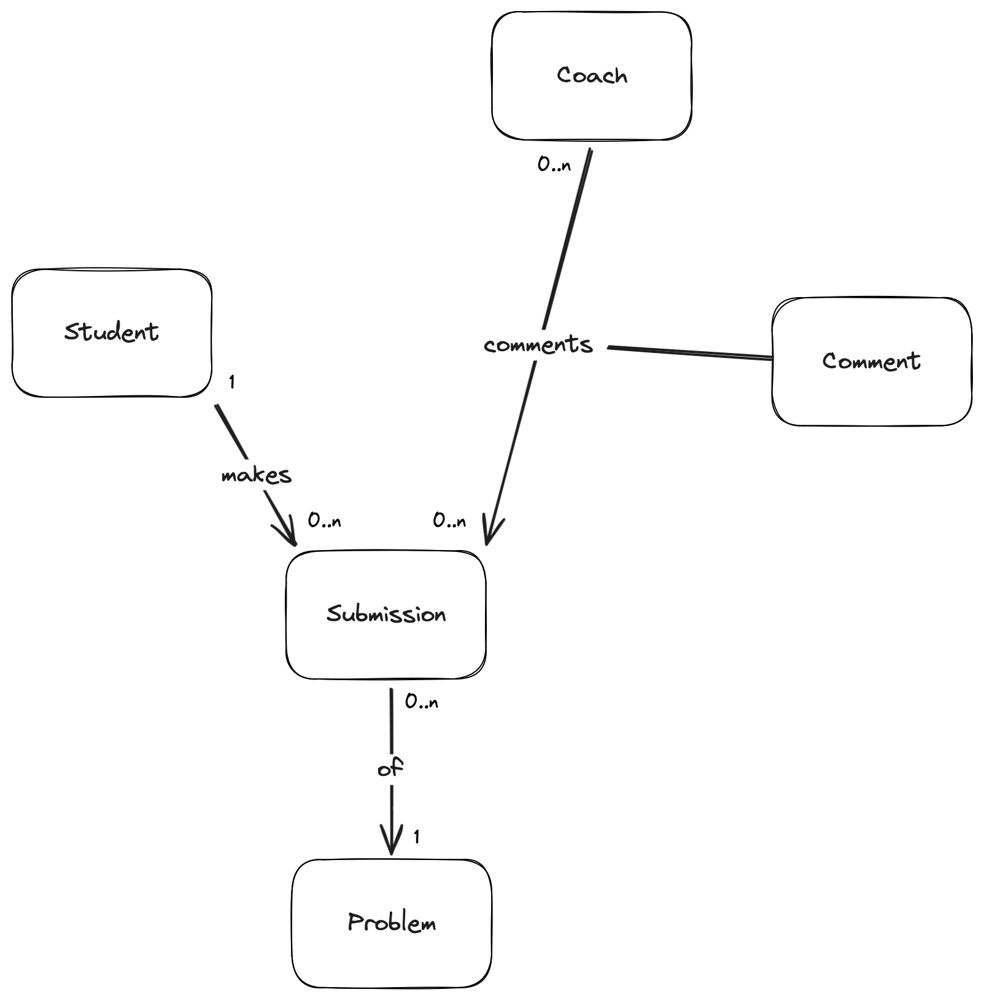

# Design Document - "Hack Your Future class"

By `YOUR NAME`

## Scope

The database for the Hack Your Future school includes all entities necessary to facilitate the process of tracking student progress and leaving feedback on student work. As such, included in the database's scope is:

* Students, including basic identifying information
* Coaches, including basic identifying information
* Student submissions, including the time at which the submission was made, the correctness score it received, and the problem to which the submission is related
* Problems, which includes basic information about the course's problems
* Comments from coaches, including the content of the comment and the submission on which the comment was left

Out of scope are elements like certificates, final grades, and other non-core attributes.

## Functional Requirements

This database will support:

* Operations to create, read, update and delete students and coaches
* Tracking all versions of student submissions, including multiple submissions for the same problem
* Adding multiple comments to a student submission from coaches

The system will **not** support:
- students responding to comments

### Entities and Relationships

The below entity relationship diagram describes the relationships among the entities in the database.

As detailed by the diagram:

* One student is capable of making 0 to many submissions. 0, if they have yet to submit any work, and many if they submit to more than one problem (or make more than one submission to any one problem). A submission is made by one and only one student. It is assumed that students will submit individual work (not group work).
* A submission is associated with one and only one problem. At the same time, a problem can have 0 to many submissions: 0 if no students have yet submitted work to that problem, and many if more than one student has submitted work for that problem.
* A submission can have 0 to many comments from 0 or multiple coaches: 0 if a coach has yet to comment, and many if a coach leaves more than one comment in a submission. 
* A coach can comment on 0 or many submissions: 0 if they have yet to comment on any students' work, and many if they have written more than 1 comment.
* There is an explicit associative entity for Comment where the contents of the comment are represented

## Representation

Entities are captured in MySQL tables with the following schema.

### Tables

The database includes the following tables:

#### Students

The `students` table includes:

* `id`, which specifies the unique ID for the student as an `INTEGER`. This column thus has the `PRIMARY KEY` constraint applied.
* `first_name`, which specifies the student's first name as `VARCHAR(255)`. Using `TEXT` is also appropriate but we to limit the maximum length of name fields.
* `last_name`, which specifies the student's last name. `VARCHAR(255)` is used for the same reason as `first_name`.
* `github_username`, which specifies the student's GitHub username. `VARCHAR(64)` is used for the same reason as `first_name`, but limiting the number of characters to 64. A `UNIQUE` constraint ensures no two students have the same GitHub username.
* `started`, which specifies when the student began the course. The default value for the `started` attribute is the current date, as denoted by `DEFAULT (CURRENT_DATE)` statement.

#### coaches

The `coaches` table includes:

* `id`, which specifies the unique ID for the coach as an `INTEGER`. This column thus has the `PRIMARY KEY` constraint applied.
* `first_name`, which specifies the coach's first name as `VARCHAR(255)`.
* `last_name`, which specifies the coach's last name as `VARCHAR(255)`.

All columns in the `coaches` table are required and hence should have the `NOT NULL` constraint applied. No other constraints are necessary.

#### Problems

The `problems` table includes:

* `id`, which specifies the unique ID for the coach as an `INTEGER`. This column thus has the `PRIMARY KEY` constraint applied.
* `problem_set`, which is an `INTEGER` specifying the number of the problem set of which the problem is a part. Problem sets are *not* represented separately, given that each is only identified by a number.
* `name`, which is the name of the problem set as `VARCHAR(255)`.

All columns in the `problems` table are required, and hence should have the `NOT NULL` constraint applied. No other constraints are necessary.

#### Submissions

The `submissions` table includes:

* `id`, which specifies the unique ID for the submission as an `INTEGER`. This column thus has the `PRIMARY KEY` constraint applied.
* `student_id`, which is the ID of the student who made the submission as an `INTEGER`. This column thus has the `FOREIGN KEY` constraint applied, referencing the `id` column in the `students` table to ensure data integrity.
* `problem_id`, which is the ID of the problem which the submission solves as an `INTEGER`. This column thus has the `FOREIGN KEY` constraint applied, referencing the `id` column in the `problems` table to ensure data integrity.
* `submission_path`, which is the path, relative to the database, at which the submission files are stored. It is assumed that all submissions are uploaded to the same server on which the database file is stored, and that submission files can be accessed by following the relative path from the database. Given that this attribute stores a filepath, not the submission files themselves, it is of type affinity `TEXT`.
* `correctness`, which is the score, as an integer from 0 to 20, the student received on the assignment. This column is represented with a `INTEGER` type affinity.
* `timestamp`, which is the timestamp at which the submission was made.

All columns are required and hence have the `NOT NULL` constraint applied where a `PRIMARY KEY` or `FOREIGN KEY` constraint is not. The `correctness` column has an additional constraint to check if its value is greater than 0 and less than or equal 20, given that this is the valid range for a correctness score. Similar to the student's `started` attribute, the submission `timestamp` attribute defaults to the current timestamp when a new row is inserted.

#### Comments

The `comments` table includes:

* `id`, which specifies the unique ID for the submission as an `INTEGER`. This column thus has the `PRIMARY KEY` constraint applied.
* `coach_id`, which specifies the ID of the coach who wrote the comment as an `INTEGER`. This column thus has the `FOREIGN KEY` constraint applied, referencing the `id` column in the `coaches` table, which ensures that each comment be referenced back to an coach.
* `submission_id`, which specifies the ID of the submission on which the comment was written as an `INTEGER`. This column thus has the `FOREIGN KEY` constraint applied, referencing the `id` column in the `submissions` table, which ensures each comment belongs to a particular submission.
* `contents`, which contains the contents of the columns as `TEXT`, given that `TEXT` can still store long-form text.

All columns are required and hence have the `NOT NULL` constraint applied where a `PRIMARY KEY` or `FOREIGN KEY` constraint is not.

## Optimizations

Per the typical queries in `queries.sql`, it is common for users of the database to access all submissions submitted by any particular student. For that reason, indexes are created on the `first_name`, `last_name`, and `github_username` columns to speed the identification of students by those columns.

Similarly, it is also common practice for a user of the database to concerned with viewing all students who submitted work to a particular problem. As such, an index is created on the `name` column in the `problems` table to speed the identification of problems by name.

## Limitations

The current schema assumes individual submissions. Collaborative submissions would require a shift to a many-to-many relationship between students and submissions.
